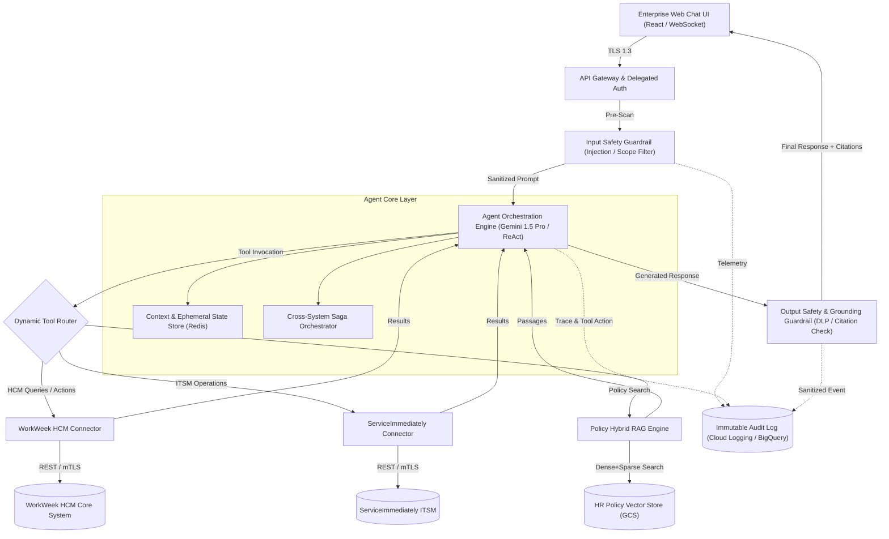
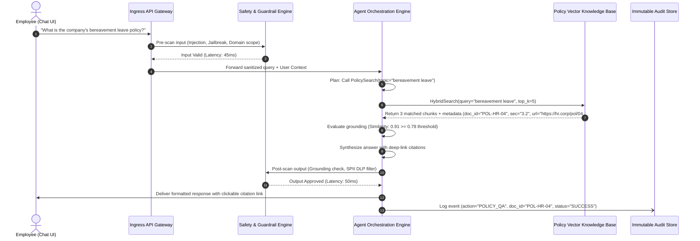
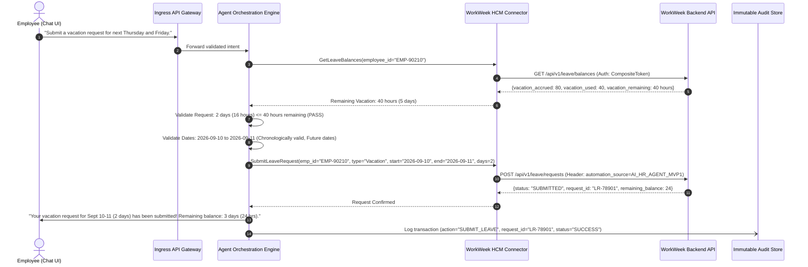
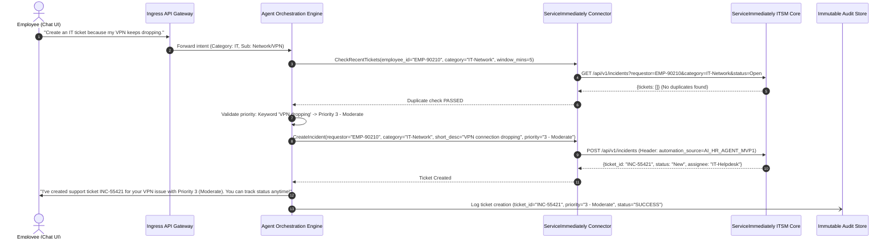
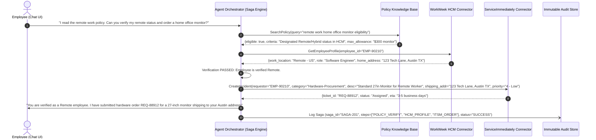
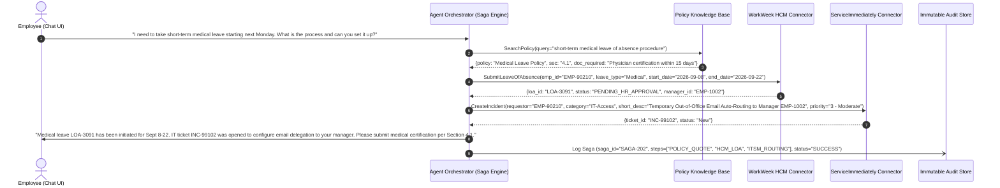
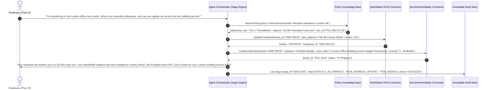

# MVP SOLUTION DESIGN DOCUMENT

### *Enterprise HR Agentic Solution (MVP 1) — System Design Document (SDD_C3_2)*


# Document Control


## Document Metadata


| Field | Value |
| --- | --- |
| Document Title | Enterprise HR Agentic Solution Design Document (MVP 1) |
| Document Identifier | SDD_C3_2 |
| Author(s) | Enterprise Solutions Architecture Team & AI Systems Engineering |
| Date | 2026-09-01 |
| Status | Under Review / Approved Baseline |
| Target Audience | Enterprise Architects, Lead Engineers, HR Operations Leaders, InfoSec & AI Compliance Officers, FinOps Team |
| Related BRD | HR Agentic Solution BRD (MVP 1) |


## Revision History


| Version | Date | Author | Description of Change |
| --- | --- | --- | --- |
| 0.1 | 2026-08-20 | AI Architecture Team | Initial draft & structural outline aligned with BRD |
| 0.2 | 2026-08-28 | Enterprise Systems Architect | Added WorkWeek, ServiceImmediately, and RAG connector schemas |
| 1.0 | 2026-09-01 | Lead Solutions Architect | Comprehensive baseline release of SDD_C3_2 for MVP 1 delivery |


# 1. Executive Summary & Scope Boundaries


## 1.1. Business Overview & Context

**Operational Problem Statement:** Modern enterprise HR and IT shared-services teams face substantial operational overhead handling repetitive Tier 1 support inquiries and administrative transactions. In the current operational model, employees must navigate fragmented systems—specifically WorkWeek for Human Capital Management (HCM) and ServiceImmediately for IT Service Management / HR Service Delivery (ITSM/HRSD)—while manually searching through static PDF/text policy repositories. This fragmentation leads to prolonged inquiry resolution times, context-switching fatigue, high support ticket volumes, and inconsistent policy interpretations.

**Solution Objective:** The HR Agentic Solution is an enterprise-grade, conversational virtual assistant designed to deliver immediate, autonomous, and zero-trust orchestration across core HR systems. By integrating generative AI reasoning with deterministic backend tool invocation, the solution provides employees with a unified conversational interface to query HR policies, execute real-time self-service profile and leave transactions in WorkWeek, manage ITSM support tickets in ServiceImmediately, and execute complex multi-system workflows.

**Key Business Goals:** The primary business goals for the MVP 1 release include: (1) Deflecting at least 40% of Tier 1 routine HR and IT helpdesk inquiries within six months; (2) Providing frictionless conversational self-service for profile updates, PTO balance queries, and leave submissions; (3) Proving the architectural feasibility of reliable multi-step cross-system orchestration (WorkWeek + ServiceImmediately + Policy Q&A); (4) Enforcing zero-trust AI governance with traceably bounded execution, 100% audit logging, and automated SPII data masking.


## 1.2. Scope Boundaries

To guarantee rapid delivery, operational reliability, and risk containment, strict architectural boundaries are defined for MVP 1.

**In-Scope Capabilities:** Table 1.2.1: In-Scope Architectural Capabilities for MVP 1


| Domain / Layer | In-Scope Capability | Technical Implementation Description |
| --- | --- | --- |
| Conversational Channel | Web-Based Chat Client | Responsive web chat UI / REST & WebSocket client with streaming token rendering. |
| Knowledge Base (RAG) | Policy Document Q&A | Hybrid dense-sparse retrieval over static PDF/Text policies (Leave, Expense, Code of Conduct, Remote Work) with strict grounding and clickable deep-link citations. |
| HCM Integration | WorkWeek Self-Service | Real-time employee profile lookup, contact update (address, phone), PTO balance fetch, and leave request submission with balance and temporal guardrails. |
| ITSM/HRSD Integration | ServiceImmediately Incident Mgmt | Incident status lookup, new support ticket creation, timeline comment appending, and lifecycle status transition (e.g. to 'Resolved') with deduplication. |
| Cross-System Orchestration | Chained Multi-Domain Workflows | Automated execution of complex cross-system scenarios: UC-2.1 (Equipment Procurement), UC-2.2 (Medical Leave), UC-2.3 (Office Relocation). |
| Security & Governance | Dual-Layer Guardrail Pipeline | Input guardrail (prompt injection / jailbreak / out-of-scope filter) and output guardrail (toxicity / hallucination / SPII redaction) with <300ms latency overhead. |
| Authentication & Audit | Delegated Composite Auth | Composite authorization token asserting employee context and automation origin (`AI_HR_AGENT_MVP1`) with 100% immutable audit logging. |

**Out-of-Scope Boundaries:** Table 1.2.2: Explicitly Out-of-Scope Items for MVP 1


| Category | Out-of-Scope Scope Item | Rationale & Target Future Phase |
| --- | --- | --- |
| External Systems | Systems beyond WorkWeek, ServiceImmediately, and Policy Repo | Preserve tight integration testing surface. ERP, CRM, and ATS deferred to Phase 2. |
| Language Support | Multi-Lingual Processing | MVP 1 strictly scoped to English. Dynamic translation pipeline scheduled for Phase 3. |
| Sensitive HR Data | Payroll, Compensation, & Performance Appraisals | Requires specialized compliance accreditation and granular field-level ACLs (Phase 2). |
| Channels | Voice IVR & Telephony Integration | MVP 1 focuses on text-based conversational interfaces. Voice CCAI planned for Phase 3. |
| Identity Management | Direct Enterprise SSO / Okta IdP Federation | MVP 1 utilizes functional test credentials with delegated user context headers. |
| Multi-Tenancy | Multi-Tenant Data Partitioning | MVP 1 operates on a dedicated single-tenant containerized architecture. |


## 1.3. Target Architecture Overview

**Architectural Topology:** The HR Agentic Solution is designed around a modern 5-tier microservices architecture hosted on a containerized, autoscaling cloud platform (Google Cloud Platform / Cloud Run & Vertex AI). The architecture decouples conversational interaction, deterministic safety filtering, cognitive agent orchestration, integration connectors, and persistence layers.





```text
+-----------------------------------------------------------------------------------+
|                           CHANNEL & PRESENTATION LAYER                             |
|   +---------------------------------------------------------------------------+   |
|   |         Enterprise Web Chat UI / Employee Portal Embed (React / Web)      |   |
+---+---------------------------------------------------------------------------+---+
                                         | HTTPS (TLS 1.3) / WebSocket
+----------------------------------------v------------------------------------------+
|                       INGRESS GATEWAY & SECURITY INTERCEPTOR                      |
|   +--------------------------+  +--------------------------+  +-----------------+ |
|   | API Gateway & Rate Limit |  | Ingress Safety Guardrail |  | Auth Delegator  | |
|   | (Cloud Armor / Kong)     |  | (Injection / Jailbreak)  |  | (Composite Token| |
|   +--------------------------+  +--------------------------+  +-----------------+ |
+----------------------------------------+------------------------------------------+
                                         | Sanitized User Request
+----------------------------------------v------------------------------------------+
|                         AGENT ORCHESTRATION LAYER (CORE)                          |
|   +---------------------------------------------------------------------------+   |
|   |  Cognitive Agent Engine (ReAct / Plan-and-Execute Loop via Gemini 1.5 Pro)|   |
|   |  - Intent Parsing & Dynamic Tool Selection                                |   |
|   |  - Conversation State Manager (Multi-Turn Ephemeral Context)              |   |
|   |  - Cross-System Saga Orchestrator (Compensating Transaction Engine)       |   |
|   +------------------------------------+--------------------------------------+   |
|                                        | Tool Function Calls                      |
|   +------------------------------------v--------------------------------------+   |
|   |  Egress Safety & Grounding Interceptor (Hallucination / SPII DLP Filter)  |   |
|   +---------------------------------------------------------------------------+   |
+----------------------------------------+------------------------------------------+
                                         | Authenticated & Scoped Calls
+----------------------------------------v------------------------------------------+
|                       INTEGRATION & KNOWLEDGE RETRIEVAL LAYER                     |
|   +--------------------+  +--------------------+  +-----------------------------+ |
|   | WorkWeek Connector |  |ServiceImmediately  |  | Policy RAG Vector Engine    | |
|   | (HCM REST Client)  |  | Connector (ITSM)   |  | (Vertex AI Search / Hybrid) | |
|   +---------+----------+  +---------+----------+  +--------------+--------------+ |
+-------------|-----------------------|----------------------------|----------------+
              |                       |                            |
+-------------v-----------------------v----------------------------v----------------+
|                         ENTERPRISE DATA & BACKEND SYSTEMS                         |
|   +--------------------+  +--------------------+  +-----------------------------+ |
|   | WorkWeek HCM Core  |  |ServiceImmediately  |  | HR Policy Document Repo     | |
|   | (Profile, PTO, LOA)|  | (Incidents, HRSD)  |  | (PDF/Text Policies in GCS)  | |
|   +--------------------+  +--------------------+  +-----------------------------+ |
|   +---------------------------------------------------------------------------+   |
|   | Governance & Audit: Ephemeral Session Cache (Redis) + Immutable Audit Log |   |
+---+---------------------------------------------------------------------------+---+
```


## 1.4. Alternatives Considered

Table 1.4.1 details key architectural trade-offs evaluated during system design.


| Architectural Decision | Options Evaluated | Selected Strategy | Trade-Off Analysis & Justification |
| --- | --- | --- | --- |
| Agent Orchestration Framework | 1. Hardcoded State Machine<br>2. AutoGen / CrewAI<br>3. LangGraph / Google GenAI SDK Agent Engine | LangGraph / Google GenAI SDK Agent Engine | Hardcoded state machines lack natural language flexibility for multi-intent dialogue. AutoGen introduces non-deterministic multi-agent chatter overhead. LangGraph / GenAI SDK provides deterministic cyclical graphs with strict tool-calling control and bounded execution. |
| Knowledge Base & RAG Architecture | 1. Pure Keyword / BM25 Search<br>2. Self-Hosted pgvector<br>3. Vertex AI Search Hybrid (Dense + Sparse) | Vertex AI Search Hybrid (Dense + Sparse) | Pure keyword search fails on semantic phrasing. Self-hosted pgvector adds operational maintenance overhead. Vertex AI Search offers managed auto-chunking, hybrid ranking, high recall, and native source attribution metadata. |
| Safety & Guardrail Pipeline | 1. Prompt-Only System Rules<br>2. Single Ingress WAF<br>3. Dual-Proxy Interceptor Pipeline | Dual-Proxy Interceptor Pipeline (Pre & Post Execution) | System prompt rules are susceptible to sophisticated jailbreaks and prompt injection. A dual-proxy architecture enforces deterministic pre-LLM injection scanning and post-LLM DLP redaction/grounding verification within a strict <300ms budget. |
| Cross-System Transaction Strategy | 1. Two-Phase Commit (2PC)<br>2. Fire-and-Forget<br>3. Saga Orchestrator with Compensating Actions | Saga Orchestrator with Compensating Actions | SaaS APIs (WorkWeek, ServiceImmediately) do not support distributed 2PC transactions. Fire-and-forget risks data divergence upon downstream failures. Saga orchestration guarantees reliable state tracking, automated rollbacks, and manual DLQ escalation. |


# 2. Production-Ready Future State Design

**Target Evolution Strategy:** While MVP 1 focuses on a single-tenant environment with functional test credentials, the solution architecture is fundamentally engineered for seamless evolution into an enterprise-wide production deployment. This section outlines the target production roadmap across multi-tenancy, enterprise identity federation, enterprise system expansion, and continuous learning.


## 2.1. Enterprise Multi-Tenancy & Global Scale

- **Multi-Tenant Logical Isolation**: Implement tenant-specific encryption keys via Google Cloud KMS (CMEK) and strict database Row-Level Security (RLS) or partitioned Redis/Vector namespaces to ensure complete data segregation across organizational subsidiaries or business units.
- **Horizontal Elasticity & High Availability**: Deploy the Agent Orchestration microservices across multi-zone Google Kubernetes Engine (GKE) clusters with Horizontal Pod Autoscaling (HPA) driven by CPU/Memory and custom concurrency metrics, targeting 99.95% production uptime.
- **Asynchronous Message Streaming**: Introduce an Apache Kafka / Google Cloud Pub/Sub event backbone to decouple long-running transactions (e.g. cross-system batch leave reconciliations) from interactive conversational threads.

## 2.2. Enterprise Identity & Access Management (IAM)

- **Identity Provider Federation**: Integrate directly with enterprise Identity Providers (Okta, Microsoft Entra ID / Azure AD, PingFederate) using OpenID Connect (OIDC) and OAuth 2.0 Authorization Code Flow with PKCE.
- **Dynamic Token Exchange (RFC 8693)**: Replace functional test credentials with dynamic OAuth 2.0 On-Behalf-Of (OBO) token exchange, ensuring downstream API calls to WorkWeek and ServiceImmediately propagate the validated end-user identity and enforce native ACLs.
- **Fine-Grained Attribute-Based Access Control (ABAC)**: Enforce contextual security policies based on employee location, department, employment status, and device posture.

## 2.3. Extended Integrations & Multi-Modal Channels

- **Enterprise HCM & ITSM Expansion**: Extend connectors to support Workday, SAP SuccessFactors, Oracle Cloud HCM, Jira Service Management, and ServiceNow Enterprise HRSD.
- **Omnichannel Engagement**: Deploy native conversational bots across Microsoft Teams, Slack Enterprise Grid, and Google Chat, as well as native mobile enterprise apps via SDKs.
- **Voice IVR & Multilingual Capabilities**: Integrate Contact Center AI (CCAI) for voice telephony support and implement an automated translation layer supporting over 20 languages with locale-specific policy grounding.

## 2.4. Autonomous Continuous Learning & LLMOps

- **Automated Evaluation & Regression Pipeline**: Establish continuous CI/CD evaluation test harnesses using Vertex AI Model Evaluation and RAGAS to benchmark prompt changes against golden test sets before production deployments.
- **Reinforcement Learning from Human Feedback (RLHF/RLAIF)**: Capture explicit user feedback (thumbs up/down, ticket escalation rates) into an anonymized telemetry store to drive continuous prompt optimization and fine-tuning.
- **End-to-End Distributed Observability**: Implement OpenTelemetry tracing across all agent execution cycles, capturing tool latencies, token consumption, retrieval scores, and error states into Cloud Trace and Datadog/Dynatrace.

# 3. System Flows, Sequence Diagrams & Agent Design


## 3.1. Agent Cognitive Architecture & Decision Loop

**Agent Decision Engine:** The agent engine is built on a ReAct (Reasoning + Acting) cognitive loop powered by Gemini 1.5 Pro / Flash. The agent dynamically parses natural language utterances, resolves user context, plans multi-step tool invocations, evaluates intermediate tool responses, and synthesizes grounded user-facing answers.

**Step-by-Step Execution Lifecycle:** 1. Ingress Request Interception: User input is received over WebSocket/HTTPS and stamped with a unique `correlation_id` and `user_id`.
2. Pre-Execution Safety Scan: Input Guardrail inspects the raw utterance for prompt injection, jailbreak attempts, and domain boundary compliance (<150ms).
3. Context Hydration: Active conversation history (last 5 turns) and user profile metadata are loaded from ephemeral Redis cache.
4. Intent & Plan Formulation: The LLM processes the prompt, evaluates available tool definitions (WorkWeek, ServiceImmediately, Policy RAG), and generates a structured tool call or direct response.
5. Guarded Tool Execution: The tool router validates parameters against deterministic schema guardrails (e.g. balance constraints, date sanity) and executes downstream REST/mTLS calls.
6. Grounding & Verification: Tool output is analyzed. For policy inquiries, passages are verified for relevance and citation integrity.
7. Post-Execution Safety Scan: Output Guardrail inspects generated content for toxicity, factual hallucination, and SPII leaks (<150ms).
8. Response Streaming & State Persist: The sanitized response is streamed to the user, and conversation state is updated in Redis.


## 3.2. End-to-End Sequence Diagrams


### Sequence Flow 1: UC-1.1 Policy Q&A with Strict Grounding & Citation Validation

Details the end-to-end execution flow when an employee asks a policy question (e.g., Bereavement Leave or Expense Guidelines).





```text
sequenceDiagram
    autonumber
    actor Employee as Employee (Chat UI)
    participant GW as Ingress API Gateway
    participant Guard as Safety & Guardrail Engine
    participant Agent as Agent Orchestration Engine
    participant RAG as Policy Vector Knowledge Base
    participant Audit as Immutable Audit Store

    Employee->>GW: "What is the company's bereavement leave policy?"
    GW->>Guard: Pre-scan input (Injection, Jailbreak, Domain scope)
    Guard-->>GW: Input Valid (Latency: 45ms)
    GW->>Agent: Forward sanitized query + User Context
    Agent->>Agent: Plan: Call PolicySearch(topic="bereavement leave")
    Agent->>RAG: HybridSearch(query="bereavement leave", top_k=5)
    RAG-->>Agent: Return 3 matched chunks + metadata (doc_id="POL-HR-04", sec="3.2", url="https://hr.corp/pol/04#s3.2")
    Agent->>Agent: Evaluate grounding (Similarity: 0.91 >= 0.78 threshold)
    Agent->>Agent: Synthesize answer with deep-link citations
    Agent->>Guard: Post-scan output (Grounding check, SPII DLP filter)
    Guard-->>Agent: Output Approved (Latency: 50ms)
    Agent->>Employee: Deliver formatted response with clickable citation link
    Agent-)Audit: Log event (action="POLICY_QA", doc_id="POL-HR-04", status="SUCCESS")
```


### Sequence Flow 2: UC-1.2 HR Self-Service (WorkWeek Leave Submission & Balance Verification)

Details leave balance verification and time-off request submission with deterministic constraint validation.





```text
sequenceDiagram
    autonumber
    actor Employee as Employee (Chat UI)
    participant GW as Ingress API Gateway
    participant Agent as Agent Orchestration Engine
    participant WW as WorkWeek HCM Connector
    participant Core as WorkWeek Backend API
    participant Audit as Immutable Audit Store

    Employee->>GW: "Submit a vacation request for next Thursday and Friday."
    GW->>Agent: Forward validated intent
    Agent->>WW: GetLeaveBalances(employee_id="EMP-90210")
    WW->>Core: GET /api/v1/leave/balances (Auth: CompositeToken)
    Core-->>WW: {vacation_accrued: 80, vacation_used: 40, vacation_remaining: 40 hours}
    WW-->>Agent: Remaining Vacation: 40 hours (5 days)
    Agent->>Agent: Validate Request: 2 days (16 hours) <= 40 hours remaining (PASS)
    Agent->>Agent: Validate Dates: 2026-09-10 to 2026-09-11 (Chronologically valid, Future dates)
    Agent->>WW: SubmitLeaveRequest(emp_id="EMP-90210", type="Vacation", start="2026-09-10", end="2026-09-11", days=2)
    WW->>Core: POST /api/v1/leave/requests (Header: automation_source=AI_HR_AGENT_MVP1)
    Core-->>WW: {status: "SUBMITTED", request_id: "LR-78901", remaining_balance: 24}
    WW-->>Agent: Request Confirmed
    Agent->>Employee: "Your vacation request for Sept 10-11 (2 days) has been submitted! Remaining balance: 3 days (24 hrs)."
    Agent-)Audit: Log transaction (action="SUBMIT_LEAVE", request_id="LR-78901", status="SUCCESS")
```


### Sequence Flow 3: UC-1.3 IT Incident Management (ServiceImmediately Ticket Lifecycle & Deduplication)

Details incident creation with automated anti-spam deduplication and priority verification.





```text
sequenceDiagram
    autonumber
    actor Employee as Employee (Chat UI)
    participant GW as Ingress API Gateway
    participant Agent as Agent Orchestration Engine
    participant SI as ServiceImmediately Connector
    participant SICore as ServiceImmediately ITSM Core
    participant Audit as Immutable Audit Store

    Employee->>GW: "Create an IT ticket because my VPN keeps dropping."
    GW->>Agent: Forward intent (Category: IT, Sub: Network/VPN)
    Agent->>SI: CheckRecentTickets(employee_id="EMP-90210", category="IT-Network", window_mins=5)
    SI->>SICore: GET /api/v1/incidents?requestor=EMP-90210&category=IT-Network&status=Open
    SICore-->>SI: {tickets: []} (No duplicates found)
    SI-->>Agent: Duplicate check PASSED
    Agent->>Agent: Validate priority: Keyword 'VPN dropping' -> Priority 3 - Moderate
    Agent->>SI: CreateIncident(requestor="EMP-90210", category="IT-Network", short_desc="VPN connection dropping", priority="3 - Moderate")
    SI->>SICore: POST /api/v1/incidents (Header: automation_source=AI_HR_AGENT_MVP1)
    SICore-->>SI: {ticket_id: "INC-55421", status: "New", assignee: "IT-Helpdesk"}
    SI-->>Agent: Ticket Created
    Agent->>Employee: "I've created support ticket INC-55421 for your VPN issue with Priority 3 (Moderate). You can track status anytime!"
    Agent-)Audit: Log ticket creation (ticket_id="INC-55421", priority="3 - Moderate", status="SUCCESS")
```


### Sequence Flow 4: UC-2.1 Cross-System Equipment Procurement Orchestration

Orchestrates Policy Q&A + WorkWeek Remote Status Verification + ServiceImmediately Hardware Procurement Request.





```text
sequenceDiagram
    autonumber
    actor Employee as Employee (Chat UI)
    participant Agent as Agent Orchestrator (Saga Engine)
    participant RAG as Policy Knowledge Base
    participant WW as WorkWeek HCM Connector
    participant SI as ServiceImmediately Connector
    participant Audit as Immutable Audit Store

    Employee->>Agent: "I read the remote work policy. Can you verify my remote status and order a home office monitor?"
    Agent->>RAG: SearchPolicy(query="remote work home office monitor eligibility")
    RAG-->>Agent: {eligible: true, criteria: "Designated Remote/Hybrid status in HCM", max_allowance: "$300 monitor"}
    Agent->>WW: GetEmployeeProfile(employee_id="EMP-90210")
    WW-->>Agent: {work_location: "Remote - US", role: "Software Engineer", home_address: "123 Tech Lane, Austin TX"}
    Agent->>Agent: Verification PASSED: Employee is verified Remote.
    Agent->>SI: CreateIncident(requestor="EMP-90210", category="Hardware-Procurement", desc="Standard 27in Monitor for Remote Worker", shipping_addr="123 Tech Lane, Austin TX", priority="4 - Low")
    SI-->>Agent: {ticket_id: "REQ-88912", status: "Assigned", eta: "3-5 business days"}
    Agent->>Employee: "You are verified as a Remote employee. I have submitted hardware order REQ-88912 for a 27-inch monitor shipping to your Austin address!"
    Agent-)Audit: Log Saga (saga_id="SAGA-201", steps=["POLICY_VERIFY", "HCM_PROFILE", "ITSM_ORDER"], status="SUCCESS")
```


### Sequence Flow 5: UC-2.2 Cross-System Medical Leave of Absence Orchestration

Orchestrates Policy Quoting + WorkWeek Leave of Absence Submission + ServiceImmediately Manager Email Delegation Ticket.





```text
sequenceDiagram
    autonumber
    actor Employee as Employee (Chat UI)
    participant Agent as Agent Orchestrator (Saga Engine)
    participant RAG as Policy Knowledge Base
    participant WW as WorkWeek HCM Connector
    participant SI as ServiceImmediately Connector
    participant Audit as Immutable Audit Store

    Employee->>Agent: "I need to take short-term medical leave starting next Monday. What is the process and can you set it up?"
    Agent->>RAG: SearchPolicy(query="short-term medical leave of absence procedure")
    RAG-->>Agent: {policy: "Medical Leave Policy", sec: "4.1", doc_required: "Physician certification within 15 days"}
    Agent->>WW: SubmitLeaveOfAbsence(emp_id="EMP-90210", leave_type="Medical", start_date="2026-09-08", end_date="2026-09-22")
    WW-->>Agent: {loa_id: "LOA-3091", status: "PENDING_HR_APPROVAL", manager_id: "EMP-1002"}
    Agent->>SI: CreateIncident(requestor="EMP-90210", category="IT-Access", short_desc="Temporary Out-of-Office Email Auto-Routing to Manager EMP-1002", priority="3 - Moderate")
    SI-->>Agent: {ticket_id: "INC-99102", status: "New"}
    Agent->>Employee: "Medical leave LOA-3091 has been initiated for Sept 8-22. IT ticket INC-99102 was opened to configure email delegation to your manager. Please submit medical certification per Section 4.1."
    Agent-)Audit: Log Saga (saga_id="SAGA-202", steps=["POLICY_QUOTE", "HCM_LOA", "ITSM_ROUTING"], status="SUCCESS")
```


### Sequence Flow 6: UC-2.3 Cross-System Office Relocation Workflow

Orchestrates Policy Relocation Allowance Quoting + WorkWeek Contact Update + ServiceImmediately Facilities Badge Provisioning.





```text
sequenceDiagram
    autonumber
    actor Employee as Employee (Chat UI)
    participant Agent as Agent Orchestrator (Saga Engine)
    participant RAG as Policy Knowledge Base
    participant WW as WorkWeek HCM Connector
    participant SI as ServiceImmediately Connector
    participant Audit as Immutable Audit Store

    Employee->>Agent: "I'm transferring to the London office next month. What is my relocation allowance, and can you update my record and sort building access?"
    Agent->>RAG: SearchPolicy(query="international transfer relocation allowance London UK")
    RAG-->>Agent: {allowance_tier: "Tier 2 Transatlantic", stipend: "£5,000 relocation lump sum", doc_id="POL-RELOC-02"}
    Agent->>WW: UpdateContactInfo(emp_id="EMP-90210", new_address="Flat 4B Canary Wharf, London, UK")
    WW-->>Agent: {status: "UPDATED", employee_id: "EMP-90210"}
    Agent->>SI: CreateIncident(requestor="EMP-90210", category="Facilities-Badge", short_desc="London Office Building Access Badge Provisioning", priority="3 - Moderate")
    SI-->>Agent: {ticket_id: "FAC-1104", status: "In-Progress"}
    Agent->>Employee: "Your relocation tier entitles you to a £5,000 lump sum. Your WorkWeek address has been updated to Canary Wharf, and Facilities ticket FAC-1104 is open for your London building access pass!"
    Agent-)Audit: Log Saga (saga_id="SAGA-203", steps=["POLICY_ALLOWANCE", "HCM_ADDRESS_UPDATE", "ITSM_BADGE"], status="SUCCESS")
```


## 3.3. Safety & Guardrail Interceptor Pipeline

**Guardrail Enforcement Architecture:** To fulfill requirement FR-1.3 and NFR-1.1 within the mandatory <300ms total latency overhead budget (NFR-2.1), the solution employs a dedicated two-stage interceptor pipeline:


| Guardrail Stage | Inspection Scope | Detection Mechanism | Latency Budget | Failure / Rejection Action |
| --- | --- | --- | --- | --- |
| Input Guardrail (Pre-Execution) | 1. Prompt Injection & Jailbreaks<br>2. Toxic / Harmful Content<br>3. Out-of-Domain Requests (Coding, Personal queries) | Fast Classifier (Llama-Guard / Gemini Flash 1.5 Classifier) + Heuristic Regex Patterns | < 140ms | Immediate execution termination; return friendly refusal; log blocked attempt with violation category in audit store. |
| Output Guardrail (Post-Execution) | 1. Factual Grounding & Hallucination<br>2. Sensitive PII / SPII Leakage<br>3. Toxic / Harmful AI Output<br>4. Citation Integrity | Google Cloud Sensitive Data Protection (DLP API) + Vector Grounding Evaluator | < 140ms | Mask detected SPII (e.g. `[REDACTED_SSN]`); reject ungrounded policy claims; fallback to safe non-technical error response. |


# 4. Security, Governance & Identity


## 4.1. Authentication Boundaries & Delegated Composite Token

**Zero-Trust Authentication Model:** To comply with FR-1.2, FR-3.1, and FR-4.1, every interaction through the Agent Orchestration layer enforces cryptographic origin verification and delegated employee scoping. Direct unauthenticated calls or ambient authority are strictly prohibited.

**Composite Token Structure:** Downstream API calls to WorkWeek and ServiceImmediately require a signed, short-lived JWT composite token passed in the HTTP `Authorization` header. The token payload explicitly encapsulates:


```json
{
  "iss": "https://auth.hr-agent.corp.internal",
  "sub": "EMP-90210",
  "aud": "https://api.workweek.corp.internal",
  "exp": 1725200000,
  "iat": 1725199100,
  "jti": "b98f2e1a-8e2b-4b6a-9f5e-12894567abcd",
  "user_context": {
    "employee_id": "EMP-90210",
    "email": "jane.doe@enterprise.corp",
    "department": "Engineering",
    "role": "Senior Software Engineer"
  },
  "automation_context": {
    "source": "AI_HR_AGENT_MVP1",
    "orchestrator_version": "1.0.0-rc2",
    "session_id": "sess-44019-abc",
    "authorized_tools": ["WorkWeek_Connector", "ServiceImmediately_Connector", "Policy_RAG"]
  }
}
```


## 4.2. Network Isolation & Zero-Trust Infrastructure

- **VPC Service Controls Perimeter**: The entire solution (Agent Core, Redis Cache, RAG Vector Engine, Secret Manager) is contained within an isolated Google Cloud Virtual Private Cloud (VPC) with VPC Service Controls restricting unauthorized data ingress/egress.
- **Private Service Connect (PSC)**: Egress to WorkWeek and ServiceImmediately core systems traverses dedicated Google Cloud Private Service Connect endpoints, eliminating exposure to the public internet.
- **Mutual TLS (mTLS) & Encryption**: All service-to-service communication mandates mTLS with TLS 1.3. Data at rest is encrypted using Google Cloud KMS with Customer-Managed Encryption Keys (CMEK).

## 4.3. Role-Based Access Control (RBAC) & Data Isolation

**Data Access Policy:** In accordance with FR-1.5, strict row-level and object-level RBAC is enforced across all operations. The system dynamically validates that the authenticated `user_id` matches the target resource identifier for all WorkWeek profile lookups, PTO balance checks, leave submissions, and ServiceImmediately ticket queries. Any cross-user query attempt triggers an immediate `403 Forbidden` response and an audit security alert.


## 4.4. Sensitive Data Handling & SPII Redaction

**Privacy & SPII Governance:** To comply with FR-1.4 and NFR-1.3 (GDPR, CCPA, labor laws), all user dialogue, prompt payloads, and model generations pass through an automated Data Loss Prevention (DLP) stream interceptor.

- **Real-Time Redaction**: Social Security Numbers (SSN), Tax IDs, bank account details, and medical diagnostic specifics are dynamically masked (`[REDACTED_SPII]`) prior to persistent logging.
- **Ephemeral Session Memory**: Redis session caches are strictly configured with a 30-minute Time-To-Live (TTL). No personal profile data or leave balance snapshots are persistently cached in the agent database (FR-3.4).

## 4.5. Immutable Audit Logging & Traceability

**Audit Logging Specification:** Every incoming interaction, safety classification decision, tool invocation, and downstream API transaction is streamed asynchronously to an immutable audit ledger (Google Cloud Logging & BigQuery Audit Dataset) with full correlation tracking (FR-1.2, NFR-1.2).


```json
{
  "event_id": "evt-778921-99a",
  "timestamp": "2026-09-01T09:15:32.412Z",
  "correlation_id": "corr-4412-bc91",
  "user_id": "EMP-90210",
  "automation_source": "AI_HR_AGENT_MVP1",
  "event_type": "TOOL_INVOCATION",
  "target_system": "WorkWeek_HCM",
  "operation": "SubmitLeaveRequest",
  "request_summary": {"leave_type": "Vacation", "days": 2, "start_date": "2026-09-10"},
  "execution_status": "SUCCESS",
  "latency_ms": 284,
  "safety_checks": {
    "input_injection_score": 0.002,
    "output_toxicity_score": 0.000,
    "spii_detected": false
  }
}
```


# 5. Integration Details & Error Handling


## 5.1. WorkWeek (HCM) Connector Specification

Table 5.1.1 outlines the REST interface contract and operational guardrails for WorkWeek HCM.


| Endpoint / Method | Operation Name | Input Parameters | Output Payload & Guardrails |
| --- | --- | --- | --- |
| GET /api/v1/employees/{id} | Retrieve Profile | employee_id: string | Returns: name, email, department, role, manager, hire_date, home_address, phone_number.<br>Guardrail: Real-time fetch only; zero caching (FR-3.4). |
| PUT /api/v1/employees/{id}/contact | Update Contact | employee_id: string,<br>home_address?: string,<br>phone_number?: string | Returns: updated_timestamp, status.<br>Guardrail: E.164 phone regex validation; address string sanitization (FR-3.3). |
| GET /api/v1/leave/balances | Query PTO Balances | employee_id: string | Returns: vacation_accrued, vacation_used, vacation_remaining, sick_accrued, sick_used, sick_remaining (hours & days). |
| POST /api/v1/leave/requests | Submit Leave Request | employee_id: string,<br>leave_type: 'Vacation'|'Sick',<br>start_date: YYYY-MM-DD,<br>end_date: YYYY-MM-DD,<br>work_days: number | Returns: request_id, status: 'SUBMITTED', remaining_balance.<br>Guardrails: Balance check (days <= remaining); Temporal sanity (start <= end, future dates) (FR-3.3). |


## 5.2. ServiceImmediately (ITSM/HRSD) Connector Specification

Table 5.2.1 outlines the REST interface contract and lifecycle constraints for ServiceImmediately.


| Endpoint / Method | Operation Name | Input Parameters | Output Payload & Guardrails |
| --- | --- | --- | --- |
| GET /api/v1/incidents/{id} | Query Ticket Details | ticket_id: string | Returns: ticket_id, requestor_id, category, short_desc, priority, status, assignee, comments_timeline. |
| POST /api/v1/incidents | Create Support Ticket | requestor_id: string,<br>category: string,<br>short_desc: string,<br>priority: '1'|'2'|'3'|'4' | Returns: ticket_id, created_at, status: 'New'.<br>Guardrails: Anti-duplicate scan (5-min window); Priority verification against criteria (FR-4.3). |
| POST /api/v1/incidents/{id}/comments | Post Ticket Comment | ticket_id: string,<br>author_id: string,<br>comment_text: string | Returns: comment_id, timestamp.<br>Guardrail: Text sanitization; automation source tag appended. |
| PATCH /api/v1/incidents/{id}/status | Update Ticket Status | ticket_id: string,<br>target_status: string,<br>resolution_notes?: string | Returns: updated_status, timestamp.<br>Guardrail: Lifecycle state transition validation (e.g. New -> In Progress -> Resolved; disallow New -> Closed) (FR-4.3). |


## 5.3. Policy Knowledge Base & RAG Ingestion Pipeline

- **Document Ingestion**: Automated Cloud Storage event triggers ingest approved PDF/Text policies (Leave, Remote Work, Expense, Code of Conduct). Updates sync within 15 minutes (FR-5.1, FR-5.5).
- **Chunking & Vectorization**: Documents are parsed and split using recursive character chunking (500 tokens, 50 token overlap) and embedded via Google `text-embedding-004` (768 dimensions).
- **Hybrid Search & Reranking**: Queries execute hybrid dense vector cosine search + sparse BM25 keyword matching with reciprocal rank fusion (RRF), retrieving top 5 candidates.
- **Strict Grounding & Citation Verification**: The agent synthesizes responses strictly from retrieved context with a minimum cosine relevance threshold of 0.78. Every policy claim includes clickable deep links (e.g., `[Remote Work Policy, Section 2.1](https://hr.corp/pol/04#s2.1)`) (FR-5.2, FR-5.3, FR-5.4).

## 5.4. Resilience & Transient Fault Tolerance

**Fault Tolerance Framework:** To ensure continuous availability (99.9% SLA, NFR-2.2) and graceful degradation (NFR-4.1, NFR-4.2), the integration layer implements resilient failure handling:

- **Exponential Backoff with Jitter**: Transient errors (HTTP 429, 502, 503, 504, network timeouts) trigger automatic retries: initial delay 500ms, backoff multiplier 2.0, max 3 retries, max backoff ceiling 4,000ms.
- **Circuit Breaker Pattern**: If downstream connectors encounter 5 consecutive failures within 30 seconds, the circuit opens for 30 seconds, immediately short-circuiting downstream calls.
- **Graceful User Fallback Messaging**: If a backend service remains unreachable, the user receives an empathetic, non-technical message (e.g., 'WorkWeek is temporarily undergoing maintenance. Your request could not be completed right now. Please try again in a few minutes or contact HR at hr@enterprise.corp.'). Internal stack traces and raw error codes are strictly masked.

## 5.5. Distributed Cross-System Transaction & Compensation Framework

**Saga Orchestration & Compensating Actions:** For multi-system orchestration workflows (UC-2.1, UC-2.2, UC-2.3), partial execution failures (e.g., WorkWeek leave succeeds, but ServiceImmediately ticket fails) are managed via an automated Saga Compensation Engine (NFR-4.3):


| Cross-System Scenario | Step 1 (Action) | Step 2 (Action) | Failure Point | Automated Compensating Action & Fallback |
| --- | --- | --- | --- | --- |
| UC-2.1 Equipment Procurement | Verify WorkWeek Remote Location | Create ServiceImmediately Hardware Ticket | Step 2 fails (ITSM API timeout) | No HCM rollback required. Log incident in Dead-Letter Queue (DLQ); alert user with direct hardware request portal link. |
| UC-2.2 Medical Leave Setup | Submit WorkWeek Leave of Absence | Create ServiceImmediately Out-of-Office Routing Ticket | Step 2 fails (ITSM error) | WorkWeek LOA is maintained in 'Pending' state. System retries ITSM ticket via asynchronous worker; notifies HR Admin queue for manual verification. |
| UC-2.3 Office Relocation | Update WorkWeek Contact Address | Create ServiceImmediately London Badge Ticket | Step 2 fails (Facilities API down) | WorkWeek address remains updated. System automatically re-queues badge provisioning ticket in background worker; confirms address update to user with pending badge note. |


# 6. Cost Estimation & FinOps


## 6.1. Key Cost Drivers Breakdown

Table 6.1.1 details the primary cost drivers across infrastructure, AI compute, and data layers.


| Cost Component | Underlying Cloud Service | Pricing Metric | Cost Optimization Lever |
| --- | --- | --- | --- |
| Cognitive Reasoning | Vertex AI (Gemini 1.5 Pro / Flash) | Per 1M Input & Output Tokens | Dynamic model routing (Flash for safety/triage, Pro for complex saga orchestration); Context caching. |
| Embeddings & RAG | Vertex AI Text-Embedding-004 & Vector Search | Per 1M Characters / Search QPS | Batch embedding updates; Top-K pruning; Semantic response caching in Redis. |
| Compute Hosting | Google Cloud Run / Cloud Functions | vCPU-seconds, Memory GiB-seconds | Scale-to-zero during off-hours; Concurrency tuning (80 concurrent requests per container instance). |
| State & Caching | Memorystore for Redis | Per GiB-hour / Instance tier | Aggressive 30-minute TTL on ephemeral session keys; 1 GB cache size sufficient for MVP 1. |
| Security & Audit | Cloud Logging & BigQuery | Per GiB ingested / Storage per GB | Log level filtering (Debug in Dev only); 30-day retention tiering in BigQuery. |


## 6.2. FinOps Cost Model: MVP 1 vs Production Scale

Table 6.2.1 provides an estimated monthly operating expenditure comparison.


| Expense Category | MVP 1 Pilot (1,000 Queries/Day) | Production Scale (50,000 Queries/Day) | Basis of Estimation |
| --- | --- | --- | --- |
| LLM Reasoning (Tokens) | $45.00 / month | $1,850.00 / month | Avg 1,200 prompt tokens + 350 output tokens per turn; Flash / Pro 80/20 mix. |
| Vector Embeddings & Search | $12.00 / month | $320.00 / month | 50 policy documents (~250k words); Hybrid search queries. |
| Container Compute (Cloud Run) | $25.00 / month | $450.00 / month | 2 vCPU / 4 GB RAM instances; Auto-scaling 1 to 15 instances. |
| Session State Cache (Redis) | $35.00 / month | $180.00 / month | 1 GB Basic instance (MVP 1) vs 5 GB Standard HA instance (Prod). |
| Audit Storage & Telemetry | $15.00 / month | $220.00 / month | Cloud Logging, Trace, and BigQuery analytics ingestion. |
| Total Estimated Monthly Cost | $132.00 / month | $3,020.00 / month | Delivers estimated $45,000/mo HR helpdesk labor savings at scale (>14x ROI). |


# 7. Deployment & Delivery Plan


## 7.1. Infrastructure as Code (IaC) & Environments

**IaC Topology:** The entire cloud infrastructure is defined declaratively using Terraform, enabling deterministic, repeatable provisioning across three isolated environments:

- **Development (`dev`)**: Single-region, scale-to-zero Cloud Run services, mocked HCM/ITSM endpoints for rapid unit and integration testing.
- **Staging / UAT (`stage`)**: High-fidelity replica connected to WorkWeek and ServiceImmediately sandbox APIs, running continuous automated eval harnesses.
- **Production (`prod`)**: Multi-zone, highly available Cloud Run deployment with strict IAM, CMEK encryption, and automated anomaly alerting.

## 7.2. CI/CD Pipeline & Automated Quality Gates

All code, prompt templates, and tool schemas are managed in Git and deployed via Google Cloud Build / GitHub Actions:

- **Stage 1: Lint & Unit Tests**: Static code analysis, Python type checking (mypy), and pytest unit test suite (Target: >85% code coverage).
- **Stage 2: Security & SAST Scanning**: Container vulnerability scanning (Trivy), secret leak detection (GitGuardian), and dependency vulnerability auditing.
- **Stage 3: Automated AI Evaluation Gate**: Executes the 330-case Golden Evaluation Dataset against the candidate build. Deployment is automatically blocked if policy accuracy drops below 95% or safety bypass exceeds 0%.
- **Stage 4: Blue/Green Canary Deployment**: Traffic splitting starting at 10% canary, monitoring error rates and latency for 15 minutes before 100% promotion.

## 7.3. Phased Implementation Roadmap & Milestones

Table 7.3.1 outlines the 8-week implementation timeline for MVP 1 delivery.


| Sprint / Phase | Timeline | Key Deliverables | Exit Criteria & Milestones |
| --- | --- | --- | --- |
| Sprint 1: Core Foundation & Guardrails | Weeks 1 - 2 | - Terraform IaC setup (VPC, Cloud Run, Secret Manager)<br>- Dual-layer Safety Guardrail pipeline<br>- Ephemeral Redis cache integration | Input/Output guardrails operational with <150ms latency; 100% prompt injection test suite blocked. |
| Sprint 2: Connectors & RAG Pipeline | Weeks 3 - 4 | - WorkWeek HCM connector & guardrails<br>- ServiceImmediately ITSM connector<br>- Policy RAG ingestion & hybrid search | All unit & mock integration tests passing; Policy Q&A achieving >90% precision on benchmark. |
| Sprint 3: Agent Orchestration & Saga Workflows | Weeks 5 - 6 | - ReAct Agent reasoning loop<br>- Single-system use cases (UC-1.1, 1.2, 1.3)<br>- Cross-system Saga workflows (UC-2.1, 2.2, 2.3) | End-to-end execution of all 6 core use cases in Staging sandbox with 100% transaction integrity. |
| Sprint 4: Security Hardening, FinOps & UAT | Weeks 7 - 8 | - End-to-end adversarial red-teaming<br>- Performance & load testing (<10s latency)<br>- Business & HR UAT sign-off | Successful UAT sign-off; Golden benchmark accuracy >=95%; Production deployment readiness review approved. |


# 8. Assumptions, Constraints, Risk & Mitigations


## 8.1. Technical & Operational Assumptions

- **API Stability**: WorkWeek and ServiceImmediately sandbox and production REST APIs remain available with <=1.5s p95 response latencies.
- **Curated Policy Corpus**: HR Operations maintains an authoritative, up-to-date repository of PDF/Text policy documents with defined section headers.
- **User Context Availability**: The client hosting interface provides a validated employee identifier in the request header.

## 8.2. MVP 1 Implementation Constraints

- **Single-Tenant Deployment**: The MVP 1 release operates in a single enterprise tenant environment; multi-tenancy is deferred.
- **Functional Test Credentials**: Backend integrations utilize functional service account credentials scoped to test user personas rather than live enterprise SSO delegation.

## 8.3. Risk Assessment Matrix & Actionable Mitigations

Table 8.3.1 details identified risks, severity levels, and engineered mitigations.


| Risk Description | Category | Impact | Likelihood | Engineered Mitigation Strategy |
| --- | --- | --- | --- | --- |
| Adversarial Prompt Injection / Jailbreak | Security | High | Medium | Deploy pre-LLM Guardrail classifier; isolate system prompts; disallow direct user instructions in tool argument execution. |
| Policy Hallucination / Fact Invention | Quality | High | Low | Enforce strict similarity thresholding (>=0.78); prompt refusal instructions when context is absent; verify citation deep links. |
| Downstream SaaS API Outage / Latency Spike | Resilience | Medium | Medium | Implement exponential backoff retries (max 3), circuit breaker pattern, and graceful non-technical fallback messages. |
| Partial Failure in Cross-System Workflows | Integrity | High | Low | Implement Saga Orchestration with automated compensating rollbacks and emergency Dead-Letter Queue (DLQ) alerts. |
| Accidental PII / SPII Data Leakage in Logs | Compliance | High | Low | Inline Cloud DLP regex and NER masking on all log streams; 30-minute TTL on ephemeral session memory. |


# 9. Quality Evaluation & UAT Framework


## 9.1. Quantitative Evaluation Metrics & Acceptance Thresholds

Table 9.1.1 defines the acceptance criteria aligned with Section 7 of the HR Agentic Solution BRD.


| Evaluation Category | Metric / Criterion | Target Acceptance Benchmark | Validation Methodology |
| --- | --- | --- | --- |
| Policy Q&A Precision | Precision & recall on policy benchmark | >= 95% Accuracy; 0% Hallucination | Automated RAGAS evaluation over 100 golden policy questions. |
| Transaction Correctness | Self-service action execution correctness | 100% Transaction Correctness | Automated synthetic transaction suites in WorkWeek & ServiceImmediately sandboxes. |
| Cross-System Orchestration | Multi-step workflow completion | 100% Pass on UC-2.1, UC-2.2, UC-2.3 | End-to-end integration test suites simulating all cross-system user paths. |
| Safety & Guardrail Efficacy | Detection of malicious prompts & toxicity | 100% Jailbreak Detection; < 1% False Positives | Automated adversarial red-teaming test suite (100 injection prompts). |
| End-to-End Latency | Time to first token / full response | < 10.0s total; Safety scan < 300ms | Cloud Trace distributed latency benchmarking under 50 concurrent virtual users. |
| Audit & Traceability | Log completeness & source origin | 100% Log Coverage with `AI_HR_AGENT_MVP1` | Log verification queries confirming all transactions contain verified audit stamps. |
| Graceful Resilience | System behavior under simulated downtime | 100% Graceful degradation; Zero stack traces leaked | Chaos engineering fault injection simulating 503 errors and network timeouts. |


## 9.2. Benchmark Dataset Curation & Golden Test Suite

**Golden Benchmark Suite Composition:** A comprehensive Golden Evaluation Dataset comprising 330 curated test cases has been authored across all functional domains:

- **100 Policy Q&A Cases**: Covering Bereavement, Parental Leave, Expense Reimbursements, Remote Work Equipment, Code of Conduct, and Health Benefits.
- **50 WorkWeek Transactions**: Covering Profile Inquiries, Contact Address/Phone Updates, PTO Balance Inquiries, and Vacation/Sick Time-Off Submissions.
- **50 ServiceImmediately ITSM Operations**: Covering Incident Status Inquiries, IT/HRSD Ticket Creations, Comment Timeline Updates, and State Transitions.
- **30 Cross-System Orchestrations**: Complex multi-turn conversations testing UC-2.1, UC-2.2, and UC-2.3 under normal and partial failure conditions.
- **100 Adversarial & Security Cases**: Direct prompt injections, jailbreak templates, roleplay exploits, SQLi/XSS syntax, and out-of-domain conversational queries.

## 9.3. UAT Execution Plan & Sign-Off Governance

**UAT Protocol:** User Acceptance Testing (UAT) will be conducted over a 10-day period in the Staging environment with a dedicated cohort of 25 enterprise evaluators representing HR Operations, IT Support Desk, InfoSec Compliance, and General Employees. Sign-off requires 100% pass rate across all blocking criteria outlined in Section 9.1.


# 10. Assumptions / Open Questions

Table 10.1.1 tracks outstanding architectural design decisions, ownership, and target resolution dates.


| Item # | Topic / Open Decision | Technical Impact & Options | Assigned Owner | Target Resolution Date | Current Status |
| --- | --- | --- | --- | --- | --- |
| OQ-01 | Policy Document Sync Latency (FR-5.5) | Define maximum allowable lag between GCS policy upload and vector re-indexing (Option A: Real-time Cloud Function 5-min; Option B: Daily batch 24-hr). | Lead Data / RAG Engineer | 2026-09-05 | Open (Proposing Option A 5-min event trigger) |
| OQ-02 | WorkWeek Contact Update Approval Workflow | Determine if personal address updates take immediate effect in WorkWeek or require HR Ops approval queue. | HR Business Systems Lead | 2026-09-06 | Pending HR Policy Alignment |
| OQ-03 | ServiceImmediately High-Priority Escalation Routing | Confirm if Priority 1 (Critical) tickets submitted via Agent trigger automated PagerDuty / SMS alerts to on-call engineers. | ITSM Operations Lead | 2026-09-07 | Under Technical Review |
| OQ-04 | Redis Session Persistence vs Memory Limit | Confirm 30-minute session TTL policy across all regional user clusters. | Cloud Infrastructure Architect | 2026-09-04 | Approved (30-min TTL baseline) |
| OQ-05 | Phase 2 SSO IdP Migration Path | Plan OIDC federation architecture for seamless cutover from test credentials to Okta SSO in Phase 2. | InfoSec & IAM Team | 2026-09-12 | Drafted in Roadmap |
