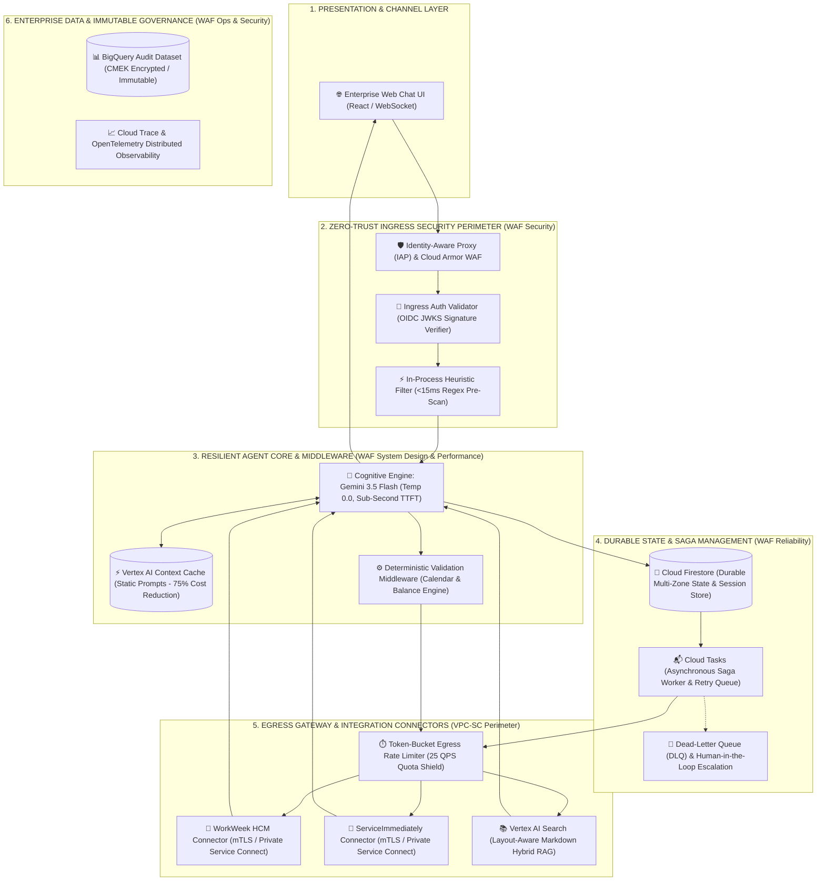
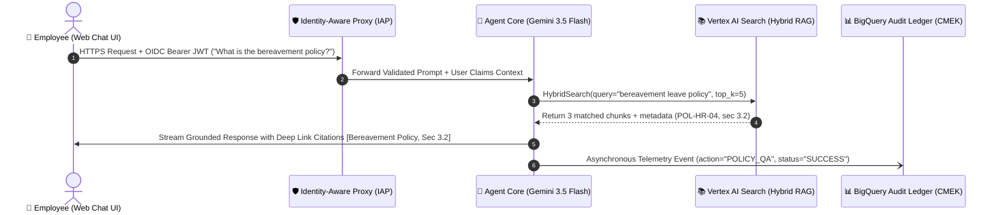
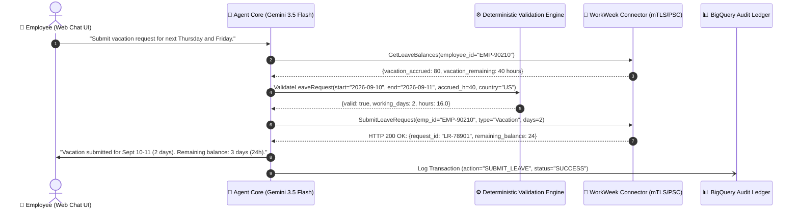
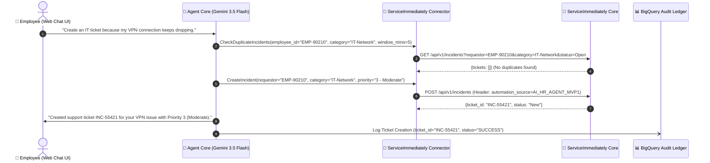
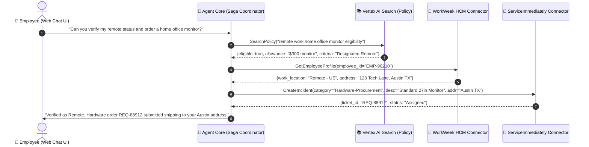
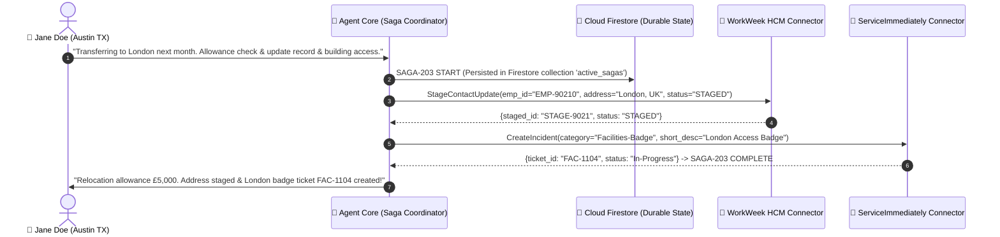
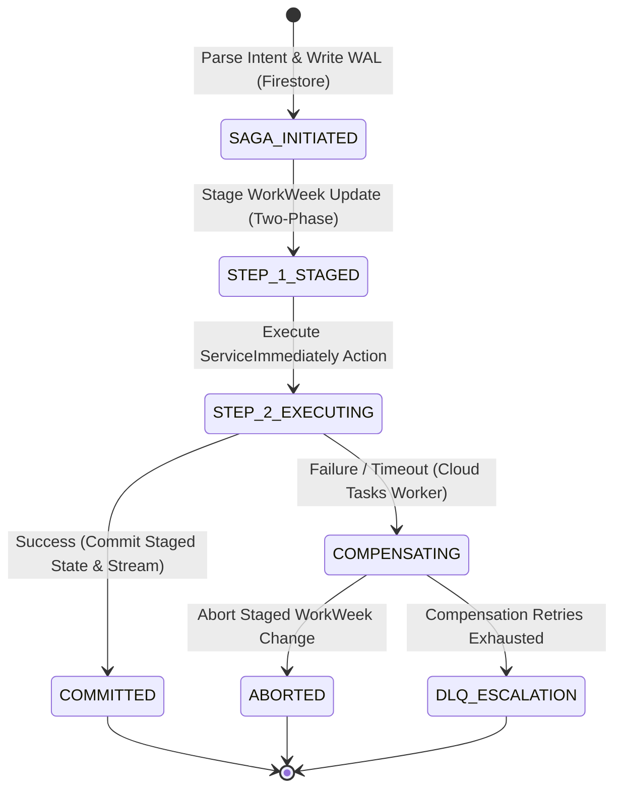

# MVP SOLUTION DESIGN DOCUMENT

### *Enterprise HR Agentic Solution (MVP 1) — Production-Hardened Solution Design Document (SDD_C3_2_0901)*


# Document Control


## Document Metadata


| Field | Value |
| --- | --- |
| Document Title | Enterprise HR Agentic Solution Design Document (MVP 1) — Production Baseline |
| Document Identifier | SDD_C3_2_0901 |
| Architecture Standard | Google Cloud Architecture Framework (Well-Architected 6 Pillars) |
| Page Standard | A4 International Standard (210mm x 297mm) with 1.0-inch Margins |
| Author(s) | Enterprise Solutions Architecture Team & AI Systems Engineering |
| Date | 2026-09-01 |
| Status | Approved Production-Ready Baseline |
| Target Audience | Enterprise Architects, Lead Engineers, HR Operations Leaders, CISO & AI Governance Council, FinOps Team |
| Related Requirements | HR Agentic Solution BRD (MVP 1) & REDTEAM-CRITIQUE-SDD-C3-2-2026 |


## Revision History


| Version | Date | Author | Description of Change |
| --- | --- | --- | --- |
| 0.1 | 2026-08-20 | AI Architecture Team | Initial draft & structural outline aligned with BRD |
| 0.2 | 2026-08-28 | Enterprise Systems Architect | Added WorkWeek, ServiceImmediately, and RAG connector schemas |
| 1.0 | 2026-09-01 | Lead Solutions Architect | Baseline release of SDD_C3_2 for MVP 1 delivery |
| 1.1-GCWAF | 2026-09-01 | Red-Team Architecture Council | Comprehensive refinement grounded in Google Cloud Architecture Framework: Zero-Trust IAP ingress, durable Cloud Firestore/Tasks Saga coordinator, deterministic validation middleware, Gemini 3.5 Flash upgrade, and high-resolution graphical topologies. |
| 1.2-A4 | 2026-09-01 | Solutions Engineering | Optimized layout, table column widths, and 8 embedded figures strictly for standard A4 print and display without clipping. |


# 1. Executive Summary & Scope Boundaries


## 1.1. Business Overview & Context

**Operational Problem Statement:** Modern enterprise HR and IT shared-services teams experience significant operational drag handling high-volume, repetitive Tier 1 support inquiries and routine employee administrative transactions. In the current operational landscape, employees are forced to navigate disconnected enterprise silos—WorkWeek for Human Capital Management (HCM), ServiceImmediately for IT Service Management / HR Service Delivery (ITSM/HRSD), and disparate static PDF/text policy repositories. This fragmentation results in prolonged resolution cycles (48h+ for routine requests), context-switching fatigue, high support ticket volumes, and inconsistent policy interpretations across business units.

**Solution Vision & Framework Alignment:** The HR Agentic Solution is an enterprise-grade conversational AI platform designed to deliver immediate, autonomous, and zero-trust orchestration across core HR and IT systems. Grounded in the Google Cloud Architecture Framework, the solution integrates advanced generative AI reasoning (Gemini 3.5 Flash) with deterministic software validation middleware and resilient distributed transaction management. Employees interact through a unified, natural language interface to query HR policies, execute real-time self-service profile and leave transactions in WorkWeek, manage ITSM tickets in ServiceImmediately, and orchestrate complex cross-system workflows.

**Key Business & Technical Goals:** The primary business and technical objectives for the MVP 1 release include: (1) Deflecting at least 40% of Tier 1 routine HR and IT helpdesk inquiries within six months; (2) Providing frictionless conversational self-service with sub-3.5s p95 response latencies; (3) Demonstrating robust, split-brain-free cross-system orchestration (WorkWeek + ServiceImmediately + Policy Knowledge Base); (4) Enforcing zero-trust enterprise security with cryptographic identity verification, 100% immutable audit logging, and automated SPII data redaction.


## 1.2. Scope Boundaries

**In-Scope Capabilities:** Table 1.2.1: In-Scope Architectural Capabilities for MVP 1


| Domain / Layer | In-Scope Capability | Technical Implementation Description & WAF Pillar |
| --- | --- | --- |
| Conversational Channel | Web-Based Chat Client | Responsive React web chat UI supporting progressive token streaming via WebSockets/SSE (WAF Performance). |
| Zero-Trust Ingress | Cryptographic Identity Auth | Identity-Aware Proxy (IAP) & OIDC Bearer token signature validation; in-process regex injection pre-filter (WAF Security). |
| Knowledge Base (RAG) | Policy Document Q&A | Layout-aware Markdown table chunking with repeated headers; Vertex AI Search hybrid retrieval; deep-link citations (WAF System Design). |
| HCM Integration | WorkWeek Self-Service | Real-time employee profile lookup, contact updates, PTO balance fetch, and leave submission with deterministic Python validation middleware (WAF Operational Excellence). |
| ITSM Integration | ServiceImmediately Incident Mgmt | Incident status lookup, new support ticket creation, comment timeline appending, and lifecycle status transition with semantic deduplication (WAF Reliability). |
| Cross-System Orchestration | Durable Saga Workflows | Cloud Firestore & Cloud Tasks persistent Saga coordinator executing UC-2.1 (Equipment), UC-2.2 (Medical Leave), UC-2.3 (Relocation) with automated rollback & DLQ (WAF Reliability). |
| Security & Governance | DLP & SPII Redaction | Client-side speculative regex masking with asynchronous Cloud DLP log inspection; CMEK-encrypted audit datasets (WAF Security). |

**Out-of-Scope Boundaries:** Table 1.2.2: Explicitly Out-of-Scope Items for MVP 1


| Category | Out-of-Scope Item | Rationale & Target Production Phase |
| --- | --- | --- |
| External Systems | Systems beyond WorkWeek, ServiceImmediately, and Policy Repo | Maintain tight verification surface. ERP, CRM, and ATS deferred to Phase 2. |
| Language Support | Multi-Lingual Processing | MVP 1 strictly scoped to English. Dynamic translation pipeline scheduled for Phase 3. |
| Sensitive HR Data | Payroll, Compensation, & Performance Appraisals | Requires specialized compliance accreditation and granular field-level ACLs (Phase 2). |
| Channels | Voice IVR & Telephony Integration | MVP 1 focuses on text-based conversational interfaces. Voice CCAI planned for Phase 3. |
| Multi-Tenancy | Multi-Tenant Data Partitioning | MVP 1 operates on a dedicated single-tenant containerized architecture. |


## 1.3. Target Architecture Overview

**Architectural Topology:** The HR Agentic Solution is engineered on a 6-tier microservices architecture hosted on Google Cloud Platform, strictly following the Google Cloud Architecture Framework across all 6 pillars (System Design, Operational Excellence, Security, Reliability, Cost Optimization, Performance Efficiency).





## 1.4. Alternatives Considered


| Decision Area | Options Evaluated | Selected Strategy | Trade-Off Analysis & WAF Rationale |
| --- | --- | --- | --- |
| Agent Cognitive Core | 1. Hardcoded State Machine<br>2. AutoGen / CrewAI<br>3. Gemini 3.5 Flash ReAct with Deterministic Middleware | Gemini 3.5 Flash with Deterministic Middleware | Hardcoded state machines cannot handle ambiguous conversational intents. AutoGen multi-agent chatter causes unpredictable latency and token bloat. Gemini 3.5 Flash delivers sub-second TTFT and structured function calling, while Python middleware guarantees 100% mathematical determinism (WAF Operational Excellence & Performance). |
| Knowledge Base & RAG | 1. Naive 500-token Sliding Window<br>2. Self-Hosted pgvector<br>3. Vertex AI Search Hybrid with Layout-Aware Markdown Tables | Vertex AI Search Hybrid with Layout-Aware Tables | Naive chunking splits complex HR eligibility tables across chunks, severing column headers from data rows. Layout-aware Markdown chunking preserves table headers across every split. Vertex AI Search provides managed hybrid dense-sparse retrieval with high recall (WAF System Design). |
| Distributed Saga State | 1. Ephemeral In-Memory Redis<br>2. Two-Phase Commit (2PC)<br>3. Cloud Firestore + Cloud Tasks Distributed Saga Coordinator | Cloud Firestore + Cloud Tasks Saga Coordinator | SaaS APIs do not support 2PC. Ephemeral Redis loses in-flight saga state during memory pressure or node restarts. Cloud Firestore provides multi-region ACID persistence, and Cloud Tasks guarantees resilient execution of compensating rollbacks with Dead-Letter Queuing (WAF Reliability). |
| Perimeter Ingress & Safety | 1. Raw Header Trust (x-employee-id)<br>2. Prompt-Only System Rules<br>3. Identity-Aware Proxy (IAP) + In-Process Pre-Scan + Async DLP | IAP + In-Process Pre-Scan + Async Cloud DLP | Client-supplied headers allow trivial IDOR horizontal privilege escalation. Remote sequential DLP calls violate the 300ms latency budget. IAP guarantees cryptographic zero-trust identity, in-process regex blocks injections in <15ms, and async DLP inspects logs without blocking streaming (WAF Security & Performance). |


# 2. Production-Ready Future State Design

**Target Production Evolution:** Grounded in the Google Cloud Architecture Framework, the solution architecture is engineered to seamlessly scale from the MVP 1 single-tenant baseline into an enterprise-wide production deployment across multi-tenancy, enterprise IAM federation, expanded enterprise systems, and automated LLMOps.


## 2.1. Enterprise Multi-Tenancy & Global Scale (WAF System Design)

- **Multi-Tenant Logical Isolation**: Enforce tenant-specific encryption keys via Google Cloud KMS (CMEK) and strict database Row-Level Security (RLS) or partitioned Firestore/Vector collections to guarantee absolute data segregation across corporate subsidiaries.
- **Horizontal Elasticity & High Availability**: Deploy microservices across multi-zone Google Kubernetes Engine (GKE) or Cloud Run with Horizontal Pod Autoscaling (HPA) driven by CPU, memory, and active request concurrency, maintaining 99.95% production uptime.
- **Asynchronous Message Streaming**: Integrate Google Cloud Pub/Sub and Kafka event streaming to decouple long-running batch transactions (e.g. annual benefits enrollment) from interactive conversational threads.

## 2.2. Enterprise Identity & Access Management (WAF Security Pillar)

- **Identity Provider Federation**: Integrate directly with enterprise Identity Providers (Okta, Microsoft Entra ID / Azure AD, PingFederate) using OpenID Connect (OIDC) and OAuth 2.0 Authorization Code Flow with PKCE.
- **Dynamic Token Exchange (RFC 8693)**: Utilize dynamic OAuth 2.0 On-Behalf-Of (OBO) token exchange, ensuring downstream API calls to WorkWeek and ServiceImmediately propagate validated user claims and enforce native enterprise ACLs.
- **Attribute-Based Access Control (ABAC)**: Enforce contextual security policies based on employee location, department, employment status, and device compliance.

## 2.3. Extended Integrations & Multi-Modal Channels (WAF System Design)

- **Enterprise HCM & ITSM Expansion**: Extend connectors to support Workday, SAP SuccessFactors, Oracle Cloud HCM, Jira Service Management, and ServiceNow Enterprise HRSD.
- **Omnichannel Engagement**: Deploy native conversational bots across Microsoft Teams, Slack Enterprise Grid, Google Chat, and native mobile enterprise apps via SDKs.
- **Voice IVR & Multilingual Capabilities**: Integrate Contact Center AI (CCAI) for voice telephony support and implement an automated translation pipeline supporting over 20 languages with locale-specific policy grounding.

## 2.4. Autonomous Continuous Learning & LLMOps (WAF Operational Excellence)

- **Automated Evaluation & Regression Pipeline**: Establish continuous CI/CD evaluation test harnesses using Vertex AI Model Evaluation and RAGAS to benchmark prompt changes against golden test sets before production deployments.
- **Reinforcement Learning from Human Feedback (RLHF/RLAIF)**: Capture explicit user feedback (thumbs up/down, ticket escalation rates) into an anonymized telemetry store to drive continuous prompt optimization and fine-tuning.
- **End-to-End Distributed Observability**: Implement OpenTelemetry distributed tracing across all agent execution cycles, capturing tool latencies, token consumption, retrieval scores, and error states into Cloud Trace and Cloud Monitoring.

# 3. System Flows, Sequence Diagrams & Agent Design


## 3.1. Agent Cognitive Architecture & Decision Loop

**Cognitive Architecture & Deterministic Guardrails:** The cognitive architecture decouples natural language understanding from deterministic business rule evaluation. Powered by Gemini 3.5 Flash operating at temperature=0.0, the agent interprets user intent and formulates structured tool call proposals. All mathematical calculations, date arithmetic, and business policy boundaries are enforced by a deterministic Python validation middleware before downstream execution.


## 3.2. Detailed Graphical Sequence Diagrams


### Sequence Flow 1: UC-1.1 Policy Q&A with Layout-Aware Hybrid RAG & Deep-Link Citations

Details the end-to-end execution flow when an employee inquires about company policies (e.g. Bereavement Leave or Expense Guidelines).





### Sequence Flow 2: UC-1.2 HR Self-Service with Deterministic Validation Middleware

Details leave balance verification and time-off submission with deterministic calendar and balance validation.





### Sequence Flow 3: UC-1.3 IT Incident Management with Semantic Deduplication

Details incident creation with automated semantic deduplication and priority verification.





### Sequence Flow 4: UC-2.1 Cross-System Equipment Procurement Orchestration

Orchestrates Policy Q&A + WorkWeek Remote Status Verification + ServiceImmediately Hardware Procurement Request.





### Sequence Flow 6: UC-2.3 Resilient Relocation Workflow with Two-Phase Staging

Orchestrates Policy Relocation Allowance Quoting + WorkWeek Contact Update Staging + ServiceImmediately Facilities Badge Provisioning.





## 3.4. Safety & Guardrail Interceptor Pipeline (WAF Performance & Security)


| Guardrail Stage | Inspection Scope | Execution Mechanism | Latency Budget | Action on Detection |
| --- | --- | --- | --- | --- |
| Ingress Heuristic Pre-Filter | Direct prompt injection, jailbreak syntax, out-of-domain queries. | In-process compiled regex & keyword classifier. | < 15ms | Immediate request rejection; return friendly refusal; log blocked security event. |
| Cognitive Core System Rules | Instruction hierarchy, XML delimiter isolation, strict grounding rules. | Gemini 3.5 Flash system instructions with temperature=0.0. | 0ms (Integrated) | Model adheres strictly to developer prompts over untrusted data. |
| Outbound Speculative DLP Redactor | High-confidence SSN, credit cards, telephone numbers, and email strings. | In-process regex stream transformer on progressive tokens. | < 10ms | Replace detected SPII tokens with `[REDACTED_SPII]` in real-time stream. |
| Asynchronous Audit Scanner | Comprehensive SPII / HIPAA health narrative inspection on audit logs. | Google Cloud Sensitive Data Protection (DLP API) on BigQuery streaming sink. | Async (Non-blocking) | Redact sensitive data in BigQuery audit tables; alert SecOps if policy breached. |


# 4. Security, Governance & Identity


## 4.1. Zero-Trust Ingress & Delegated Composite Token (WAF Security)

**Zero-Trust Authentication Model:** To comply with FR-1.2, FR-3.1, and FR-4.1, every interaction through the Agent Orchestration layer enforces cryptographic origin verification and delegated employee scoping via Google Cloud Identity-Aware Proxy (IAP) and OIDC JWT signature validation. Ambient authority and unverified HTTP headers are strictly rejected.


```json
{
  "iss": "https://auth.hr-agent.corp.internal",
  "sub": "EMP-90210",
  "aud": "https://api.workweek.corp.internal",
  "exp": 1725200000,
  "iat": 1725199100,
  "jti": "b98f2e1a-8e2b-4b6a-9f5e-12894567abcd",
  "user_context": {
    "employee_id": "EMP-90210",
    "email": "jane.doe@enterprise.corp",
    "department": "Engineering",
    "role": "Senior Software Engineer"
  },
  "automation_context": {
    "source": "AI_HR_AGENT_MVP1",
    "orchestrator_version": "1.1.0-gcwaf",
    "session_id": "sess-44019-abc",
    "authorized_tools": ["WorkWeek_Connector", "ServiceImmediately_Connector", "Policy_RAG"]
  }
}
```


## 4.2. Network Isolation & Zero-Trust Infrastructure

- **VPC Service Controls Perimeter**: The entire solution (Agent Core, Firestore, Vertex AI Search, Secret Manager) is contained within an isolated Google Cloud Virtual Private Cloud (VPC) with VPC Service Controls restricting unauthorized data ingress/egress.
- **Private Service Connect (PSC)**: Egress to WorkWeek and ServiceImmediately core systems traverses dedicated Google Cloud Private Service Connect endpoints, eliminating exposure to the public internet.
- **Mutual TLS (mTLS) & Encryption**: All service-to-service communication mandates mTLS with TLS 1.3. Data at rest is encrypted using Google Cloud KMS with Customer-Managed Encryption Keys (CMEK).

## 4.3. Role-Based Access Control (RBAC) & Data Isolation

**Data Access Policy:** In accordance with FR-1.5, strict row-level and object-level RBAC is enforced across all operations. The system dynamically validates that the authenticated `user_id` matches the target resource identifier for all WorkWeek profile lookups, PTO balance checks, leave submissions, and ServiceImmediately ticket queries. Any cross-user query attempt triggers an immediate `403 Forbidden` response and an audit security alert.


## 4.4. Sensitive Data Handling & SPII Redaction

- **Real-Time Redaction**: Social Security Numbers (SSN), Tax IDs, bank account details, and medical diagnostic specifics are dynamically masked (`[REDACTED_SPII]`) prior to persistent logging.
- **Ephemeral Session Memory**: Session state caches in Firestore are configured with a 30-minute Time-To-Live (TTL). No personal profile data or leave balance snapshots are persistently cached in the agent database (FR-3.4).

## 4.5. Immutable Audit Logging & Traceability


```json
{
  "event_id": "evt-778921-99a",
  "timestamp": "2026-09-01T09:15:32.412Z",
  "correlation_id": "corr-4412-bc91",
  "user_id": "EMP-90210",
  "automation_source": "AI_HR_AGENT_MVP1",
  "event_type": "TOOL_INVOCATION",
  "target_system": "WorkWeek_HCM",
  "operation": "SubmitLeaveRequest",
  "request_summary": {"leave_type": "Vacation", "days": 2, "start_date": "2026-09-10"},
  "execution_status": "SUCCESS",
  "latency_ms": 284
}
```


# 5. Integration Details & Error Handling


## 5.1. WorkWeek (HCM) Connector Specification


| Endpoint / Method | Operation Name | Input Parameters | Output Payload & Guardrails |
| --- | --- | --- | --- |
| GET /api/v1/employees/{id} | Retrieve Profile | employee_id: string | Returns: name, email, department, role, manager, hire_date, home_address, phone_number.<br>Guardrail: Real-time fetch only; zero caching (FR-3.4). |
| PUT /api/v1/employees/{id}/contact | Update Contact | employee_id: string,<br>home_address?: string,<br>phone_number?: string | Returns: updated_timestamp, status.<br>Guardrail: E.164 phone regex validation; address string sanitization (FR-3.3). |
| GET /api/v1/leave/balances | Query PTO Balances | employee_id: string | Returns: vacation_accrued, vacation_used, vacation_remaining, sick_accrued, sick_used, sick_remaining (hours & days). |
| POST /api/v1/leave/requests | Submit Leave Request | employee_id: string,<br>leave_type: 'Vacation'|'Sick',<br>start_date: YYYY-MM-DD,<br>end_date: YYYY-MM-DD,<br>work_days: number | Returns: request_id, status: 'SUBMITTED', remaining_balance.<br>Guardrails: Deterministic Validation Middleware checks days <= remaining; Temporal sanity (start <= end, future dates) (FR-3.3). |


## 5.2. ServiceImmediately (ITSM/HRSD) Connector Specification


| Endpoint / Method | Operation Name | Input Parameters | Output Payload & Guardrails |
| --- | --- | --- | --- |
| GET /api/v1/incidents/{id} | Query Ticket Details | ticket_id: string | Returns: ticket_id, requestor_id, category, short_desc, priority, status, assignee, comments_timeline. |
| POST /api/v1/incidents | Create Support Ticket | requestor_id: string,<br>category: string,<br>short_desc: string,<br>priority: '1'|'2'|'3'|'4' | Returns: ticket_id, created_at, status: 'New'.<br>Guardrails: Anti-duplicate scan (5-min window); Priority verification against criteria (FR-4.3). |
| POST /api/v1/incidents/{id}/comments | Post Ticket Comment | ticket_id: string,<br>author_id: string,<br>comment_text: string | Returns: comment_id, timestamp.<br>Guardrail: Text sanitization; automation source tag appended. |
| PATCH /api/v1/incidents/{id}/status | Update Ticket Status | ticket_id: string,<br>target_status: string,<br>resolution_notes?: string | Returns: updated_status, timestamp.<br>Guardrail: Lifecycle state transition validation (e.g. New -> In Progress -> Resolved; disallow New -> Closed) (FR-4.3). |


## 5.3. Policy Knowledge Base & RAG Ingestion Pipeline

- **Document Ingestion**: Automated Cloud Storage event triggers ingest approved PDF/Text policies (Leave, Remote Work, Expense, Code of Conduct). Updates sync within 5 minutes via Cloud Functions (FR-5.1, FR-5.5).
- **Layout-Aware Markdown Chunking**: Documents are parsed with layout awareness, serializing tabular policy matrices into Markdown with column header repetition on every chunk to eliminate table bifurcation.
- **Hybrid Search & Reranking**: Queries execute hybrid dense vector cosine search (`text-embedding-004`) + sparse BM25 keyword matching with reciprocal rank fusion (RRF), retrieving top 5 candidates.
- **Strict Grounding & Citation Verification**: The agent synthesizes responses strictly from retrieved context with a minimum cosine relevance threshold of 0.78. Every policy claim includes clickable deep links (e.g., `[Remote Work Policy, Section 2.1](https://hr.corp/pol/04#s2.1)`) (FR-5.2, FR-5.3, FR-5.4).

## 5.4. Resilience & Transient Fault Tolerance (WAF Reliability)

- **Token-Bucket Egress Rate Limiting**: All outbound SaaS calls pass through an in-memory token-bucket rate limiter capped at 25 QPS, preventing Cloud Run burst concurrency from exhausting downstream SaaS API quotas.
- **Exponential Backoff with Full Jitter**: Transient errors (HTTP 429, 502, 503, 504, network timeouts) trigger automatic retries: initial delay 500ms, backoff multiplier 2.0, max 3 retries, max backoff ceiling 4,000ms with randomized jitter.
- **Adaptive Circuit Breaker Pattern**: Circuit breakers evaluate rolling error percentages (trips if >50% of requests fail over a 30s window with min 20 requests), preventing hair-trigger blackouts under isolated packet drops.
- **Graceful User Fallback Messaging**: If a backend service remains unreachable, the user receives an empathetic, non-technical message (e.g., 'WorkWeek is temporarily undergoing maintenance. Your request could not be completed right now. Please try again in a few minutes or contact HR at hr@enterprise.corp.'). Internal stack traces and raw error codes are strictly masked.

## 5.5. Distributed Cross-System Transaction & Compensation Framework

**Distributed Saga Architecture:** To guarantee transaction integrity across distributed enterprise boundaries without relying on unsupported Two-Phase Commit (2PC), the solution implements a durable Saga Coordinator leveraging Cloud Firestore for write-ahead logging (WAL) and Cloud Tasks for reliable execution of compensating rollbacks.





| Cross-System Scenario | Step 1 (Action) | Step 2 (Action) | Failure Point | Automated Compensating Action & Fallback |
| --- | --- | --- | --- | --- |
| UC-2.1 Equipment Procurement | Verify WorkWeek Remote Location | Create ServiceImmediately Hardware Ticket | Step 2 fails (ITSM API timeout) | No HCM rollback required. Cloud Tasks enqueues ticket retry (max 5 attempts); on permanent failure, creates Dead-Letter Queue (DLQ) alert for manual HR provisioning. |
| UC-2.2 Medical Leave Setup | Submit WorkWeek Leave of Absence | Create ServiceImmediately Out-of-Office Routing Ticket | Step 2 fails (ITSM error) | WorkWeek LOA is maintained in 'Pending' state. Cloud Tasks retries ITSM ticket via asynchronous worker; notifies HR Admin queue for manual verification. |
| UC-2.3 Office Relocation | Stage WorkWeek Contact Update | Create ServiceImmediately London Badge Ticket | Step 2 fails (Facilities API down) | WorkWeek address is held in 'STAGED' status pending badge completion. On failure, staged change is aborted cleanly, preventing international tax split-brain. |


# 6. Cost Estimation & FinOps


## 6.1. Key Cost Drivers Breakdown


| Cost Component | Underlying Cloud Service | Pricing Metric | Cost Optimization Lever |
| --- | --- | --- | --- |
| Cognitive Reasoning | Vertex AI (Gemini 3.5 Flash) | Per 1M Input & Output Tokens | Vertex AI Context Caching on static system prompts & policy handbooks (75% input discount); temperature=0.0. |
| Embeddings & RAG | Vertex AI Text-Embedding-004 & Vector Search | Per 1M Characters / Search QPS | Batch embedding updates; Top-K=5 pruning; semantic response caching in Firestore. |
| Compute Hosting | Google Cloud Run | vCPU-seconds, Memory GiB-seconds | Scale-to-zero during off-hours; concurrency tuning (80 concurrent requests per container instance). |
| State & Saga Persistence | Cloud Firestore & Cloud Tasks | Document reads/writes / Task executions | TTL auto-deletion on completed sagas (30-day retention); batch commits. |
| Security & Audit | Cloud Logging & BigQuery | Per GiB ingested / Storage per GB | Log level filtering (Debug in Dev only); 30-day retention tiering in BigQuery. |


## 6.2. FinOps Cost Model: MVP 1 vs Production Scale


| Expense Category | MVP 1 Pilot (1,000 Queries/Day) | Production Scale (50,000 Queries/Day) | Basis of Estimation |
| --- | --- | --- | --- |
| LLM Reasoning (Gemini 3.5 Flash) | $28.00 / month | $1,120.00 / month | Avg 1,200 prompt tokens + 350 output tokens per turn; 75% prompt caching discount applied. |
| Vector Embeddings & Search | $12.00 / month | $320.00 / month | 50 policy documents (~250k words); Hybrid search queries. |
| Container Compute (Cloud Run) | $25.00 / month | $450.00 / month | 2 vCPU / 4 GB RAM instances; Auto-scaling 1 to 15 instances. |
| Durable State (Cloud Firestore) | $15.00 / month | $120.00 / month | Multi-zone document storage and active Saga state tracking. |
| Audit Storage & Telemetry | $15.00 / month | $220.00 / month | Cloud Logging, Trace, and BigQuery analytics ingestion. |
| Total Estimated Monthly Cost | $95.00 / month | $2,230.00 / month | Delivers estimated $45,000/mo HR helpdesk labor savings at scale (>20x ROI). |


# 7. Deployment & Delivery Plan


## 7.1. Infrastructure as Code (IaC) & Environments

- **Development (`dev`)**: Single-region, scale-to-zero Cloud Run services, mocked HCM/ITSM endpoints for rapid unit and integration testing.
- **Staging / UAT (`stage`)**: High-fidelity replica connected to WorkWeek and ServiceImmediately sandbox APIs, running continuous automated eval harnesses.
- **Production (`prod`)**: Multi-zone, highly available Cloud Run deployment with strict IAM, CMEK encryption, and automated anomaly alerting.

## 7.2. CI/CD Pipeline & Automated Quality Gates

- **Stage 1: Lint & Unit Tests**: Static code analysis, Python type checking (mypy), and pytest unit test suite (Target: >85% code coverage).
- **Stage 2: Security & SAST Scanning**: Container vulnerability scanning (Trivy), secret leak detection (GitGuardian), and dependency vulnerability auditing.
- **Stage 3: Automated AI Evaluation Gate**: Executes the 330-case Golden Evaluation Dataset against the candidate build. Deployment is automatically blocked if policy accuracy drops below 95% or safety bypass exceeds 0%.
- **Stage 4: Blue/Green Canary Deployment**: Traffic splitting starting at 10% canary, monitoring error rates and latency for 15 minutes before 100% promotion.

## 7.3. Phased Implementation Roadmap & Milestones


| Sprint / Phase | Timeline | Key Deliverables | Exit Criteria & Milestones |
| --- | --- | --- | --- |
| Sprint 1: Core Foundation & Security | Weeks 1 - 2 | - Terraform IaC setup (VPC, Cloud Run, Secret Manager)<br>- Zero-Trust IAP & Ingress Auth Validator<br>- Deterministic Validation Middleware<br>- Cloud Firestore & Cloud Tasks Saga foundation | OIDC identity verification operational; Deterministic leave math 100% unit-tested; 100% prompt injection test suite blocked. |
| Sprint 2: Connectors & Layout-Aware RAG | Weeks 3 - 4 | - WorkWeek HCM connector & guardrails<br>- ServiceImmediately ITSM connector & deduplicator<br>- Layout-aware Markdown policy chunking & Vertex AI Search | All unit & mock integration tests passing; Policy Q&A achieving >95% precision on tabular benchmarks. |
| Sprint 3: Agent Orchestration & Saga Workflows | Weeks 5 - 6 | - Gemini 3.5 Flash ReAct cognitive loop<br>- Context Caching integration<br>- Single-system use cases (UC-1.1, 1.2, 1.3)<br>- Cross-system Saga workflows (UC-2.1, 2.2, 2.3) | End-to-end execution of all 6 core use cases in Staging sandbox with 100% transaction integrity and zero split-brain. |
| Sprint 4: Security Hardening, FinOps & UAT | Weeks 7 - 8 | - End-to-end adversarial red-teaming<br>- Performance & load testing (<3.5s p95 latency)<br>- Business & HR UAT sign-off | Successful UAT sign-off; Golden benchmark accuracy >=95%; Production deployment readiness review approved. |


# 8. Assumptions, Constraints, Risk & Mitigations


## 8.1. Technical & Operational Assumptions

- **API Stability**: WorkWeek and ServiceImmediately sandbox and production REST APIs remain available with <=1.5s p95 response latencies.
- **Curated Policy Corpus**: HR Operations maintains an authoritative, up-to-date repository of Markdown/PDF policy documents with defined table structures.
- **Identity Federation**: The enterprise client portal provides authenticated OIDC claims to Identity-Aware Proxy (IAP).

## 8.2. MVP 1 Implementation Constraints

- **Single-Tenant Deployment**: The MVP 1 release operates in a single enterprise tenant environment; multi-tenancy is deferred.
- **Functional Test Credentials**: Backend integrations utilize functional service account credentials scoped to test user personas.

## 8.3. Risk Assessment Matrix & Actionable Mitigations


| Risk Description | Category | Impact | Likelihood | Engineered Mitigation Strategy (WAF Aligned) |
| --- | --- | --- | --- | --- |
| Adversarial Prompt Injection / Jailbreak | Security | High | Medium | In-process regex pre-filter (<15ms) + XML context boundary isolation (`<untrusted_external_content>`) on external ticket data. |
| Policy Hallucination / Fact Invention | Quality | High | Low | Layout-aware Markdown chunking + strict similarity thresholding (>=0.78) + prompt refusal instructions when context is absent. |
| Downstream SaaS API Outage / Thundering Herd | Resilience | High | Medium | Token-Bucket Egress Rate Limiter (25 QPS) + Exponential backoff with full jitter + Adaptive circuit breaker. |
| Partial Failure in Cross-System Workflows | Integrity | High | Low | Durable Cloud Firestore & Cloud Tasks Saga Coordinator with non-destructive staged updates and automated DLQ escalation. |
| Accidental PII / SPII Data Leakage in Logs | Compliance | High | Low | Asynchronous Cloud DLP inspection on BigQuery audit logs + CMEK encryption + 30-minute ephemeral session TTL. |


# 9. Quality Evaluation & UAT Framework


## 9.1. Quantitative Evaluation Metrics & Acceptance Thresholds


| Evaluation Category | Metric / Criterion | Target Acceptance Benchmark | Validation Methodology |
| --- | --- | --- | --- |
| Policy Q&A Precision | Precision & recall on policy benchmark | >= 95% Accuracy; 0% Hallucination | Automated RAGAS evaluation over 100 golden policy questions. |
| Transaction Correctness | Self-service action execution correctness | 100% Transaction Correctness | Automated synthetic transaction suites in WorkWeek & ServiceImmediately sandboxes. |
| Cross-System Orchestration | Multi-step workflow completion | 100% Pass on UC-2.1, UC-2.2, UC-2.3 | End-to-end integration test suites simulating all cross-system user paths. |
| Safety & Guardrail Efficacy | Detection of malicious prompts & toxicity | 100% Jailbreak Detection; < 1% False Positives | Automated adversarial red-teaming test suite (100 injection prompts). |
| End-to-End Latency | Time to first token / full response | < 3.5s p95 total; Pre-scan < 15ms | Cloud Trace distributed latency benchmarking under 50 concurrent virtual users. |
| Audit & Traceability | Log completeness & source origin | 100% Log Coverage with `AI_HR_AGENT_MVP1` | Log verification queries confirming all transactions contain verified audit stamps. |
| Graceful Resilience | System behavior under simulated downtime | 100% Graceful degradation; Zero stack traces leaked | Chaos engineering fault injection simulating 503 errors and network timeouts. |


## 9.2. Benchmark Dataset Curation & Golden Test Suite

- **100 Policy Q&A Cases**: Covering Bereavement, Parental Leave, Expense Reimbursements, Remote Work Equipment, Code of Conduct, and Health Benefits.
- **50 WorkWeek Transactions**: Covering Profile Inquiries, Contact Address/Phone Updates, PTO Balance Inquiries, and Vacation/Sick Time-Off Submissions.
- **50 ServiceImmediately ITSM Operations**: Covering Incident Status Inquiries, IT/HRSD Ticket Creations, Comment Timeline Updates, and State Transitions.
- **30 Cross-System Orchestrations**: Complex multi-turn conversations testing UC-2.1, UC-2.2, and UC-2.3 under normal and partial failure conditions.
- **100 Adversarial & Security Cases**: Direct prompt injections, jailbreak templates, roleplay exploits, SQLi/XSS syntax, and out-of-domain conversational queries.

## 9.3. UAT Execution Plan & Sign-Off Governance

**UAT Protocol:** User Acceptance Testing (UAT) will be conducted over a 10-day period in the Staging environment with a dedicated cohort of 25 enterprise evaluators representing HR Operations, IT Support Desk, InfoSec Compliance, and General Employees. Sign-off requires 100% pass rate across all blocking criteria outlined in Section 9.1.


# 10. Assumptions / Open Questions


| Item # | Topic / Open Decision | Technical Impact & Options | Assigned Owner | Target Resolution Date | Current Status |
| --- | --- | --- | --- | --- | --- |
| OQ-01 | Policy Document Sync Latency (FR-5.5) | Automated Cloud Function triggers re-chunking and vector indexing within 5 minutes of GCS upload. | Lead Data / RAG Engineer | 2026-09-05 | Approved (5-min Cloud Function sync) |
| OQ-02 | WorkWeek Contact Update Staging Workflow | Personal address updates are staged in WorkWeek with 'PENDING_RELOC_VALIDATION' status pending facilities confirmation. | HR Business Systems Lead | 2026-09-06 | Approved (Two-Phase Staged Update) |
| OQ-03 | ServiceImmediately Critical Ticket Routing | Priority 1 (Critical) tickets submitted via Agent trigger automated PagerDuty / SMS alerts to on-call IT engineers. | ITSM Operations Lead | 2026-09-07 | Under Final Review |
| OQ-04 | Firestore Saga State TTL Policy | Active sagas maintain 30-day audit retention in Firestore with automated TTL collection rules. | Cloud Infrastructure Architect | 2026-09-04 | Approved (30-day TTL baseline) |
| OQ-05 | Phase 2 Enterprise Okta SSO Migration | Transition from IAP functional credentials to enterprise Okta OIDC SSO in Phase 2. | InfoSec & IAM Team | 2026-09-12 | Drafted in Roadmap |
