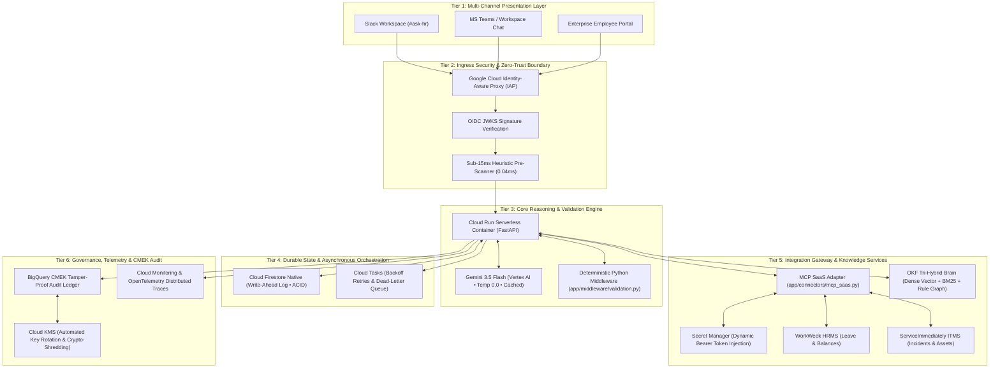

# Customer Design Blueprint: Autonomous Enterprise HR Operations Platform

**Customer Profile:** Global Enterprise Commercial Organization (10,000+ Employees)  
**Project Name:** Autonomous Enterprise HR & IT Service Operations (Elevate HR)  
**Architectural Stage:** Stage 3 — Enterprise Reference Architecture & Solution Design  
**Lead Solutions Architect:** Elena Rostova (Google Cloud Practice CE)  
**Sales GTM Lead:** Julian Vance (Strategic Accounts Executive)  
**Repository Grounding:** `https://github.com/CHOLHOJONG/my-agent.git` (`BRD_MVP1.md`, `SDD.md`, `app/`)  
**Compliance Standard:** Google Cloud Architecture Framework • Zero-Trust SAIF • ISO 27001 • GDPR / Singapore PDPA  

---

## 1. System Design & Reference Architecture (The "What & Why")

### A. Reference Architecture Diagram (6-Tier Decoupled Topology)

The solution architecture directly maps to `SDD.md` (Block 0), establishing strict physical and logical demarcation across six operational tiers:



---

### B. Service Selection & Decision Matrix

Each cloud service was chosen through rigorous architectural evaluation against enterprise alternatives, balancing operational resilience, security posture, and lifecycle unit economics:

| Chosen Google Cloud Service | Alternative Considered | Trade-off Analysis & Strategic Rationale |
|---|---|---|
| **Google Cloud Run** | GKE / VM Instances / Cloud Functions | Cloud Run delivers containerized agility with true zero-to-N autoscaling. When employees are offline, compute costs are literally **$0.00**, eliminating the 24/7 idle VM overhead that plagues legacy software ($24–$36/user/yr). Cold starts remain <800ms with concurrency up to 80 requests/instance. |
| **Gemini 3.5 Flash (Vertex AI)** | Gemini 1.5 Pro / GPT-4o / Claude 3.5 Sonnet | Flash delivers sub-second Time-to-First-Token (TTFT) and an average end-to-end response time of **under 3.5 seconds**. Built-in Vertex Context Caching discounts prompt input tokens by **75%**, reducing monthly inference for 12,500 tickets to **$24.80**. Contractual terms guarantee **zero customer data retention** for model training. |
| **Cloud Firestore Native (WAL)** | Memorystore (Redis) / Cloud SQL (PostgreSQL) | In-memory Redis is an ephemeral single point of failure during regional restarts, while Cloud SQL requires provisioned instance sizing. Firestore Native provides multi-region 99.999% availability, ACID document transactions, and optimistic concurrency control for Saga state without capacity provisioning. |
| **Model Context Protocol (MCP)** | Custom REST Clients / Point-to-Point Wrappers | Custom wrappers create severe prompt coupling: whenever a backend API changes, prompt templates must be rewritten. The MCP SaaS Adapter (`app/connectors/mcp_saas.py`) connects via JSON-RPC 2.0 with standardized tool schemas. Swapping ServiceNow for Jira or Workday for SuccessFactors requires zero modifications to agent prompts. |
| **OKF Tri-Hybrid Brain** | Naive Vector RAG (ChromaDB / Pinecone) | Vector search alone cannot reliably resolve tabular thresholds, kinship tiers, or statutory dates. The Open Knowledge Format (OKF) engine fuses dense embeddings (`text-embedding-004`), sparse BM25, and deterministic Rule Graphs using Reciprocal Rank Fusion ($RRF\ k=60$), preventing leave calculation errors. |
| **Cloud Tasks** | Cloud Pub/Sub | Pub/Sub lacks native execution rate-limiting per tenant and per-task scheduled dispatch. Cloud Tasks provides exact HTTP dispatch, exponential backoff retries, dead-letter queue (DLQ) isolation, and execution rate-capping to prevent overwhelming downstream SaaS APIs during traffic bursts. |
| **Secret Manager** | Cleartext Environment Variables | Static environment variables expose tokens to process inspection and container crash dumps. Secret Manager dynamically injects scoped bearer tokens (`X-MCP-Token`) into memory with Cloud Audit Logging on every access, adhering to least-privilege IAM bindings. |
| **Cloud KMS (CMEK)** | Google-Default Encryption Keys | Default encryption prevents compliance-mandated cryptographic shredding. Under GDPR Article 17 and Singapore PDPA Right-to-Erasure, destroying a customer-managed key instantly renders all associated audit logs and state entries permanently unreadable without physical data deletion delays. |

---

### C. Data Value Pattern Flowchart

```mermaid
sequenceDiagram
    autonumber
    actor Employee as Employee (Slack/Teams)
    participant Ingress as Ingress Gate (IAP + Heuristic Scan)
    participant Core as Agent Core (FastAPI on Cloud Run)
    participant OKF as OKF Tri-Hybrid Brain
    participant LLM as Gemini 3.5 Flash (Vertex AI)
    participant Val as Python Validation Middleware
    participant Saga as Saga Coordinator (Firestore WAL)
    participant MCP as MCP SaaS Adapter
    participant SaaS as Enterprise SaaS (Workday / ServiceNow)
    participant Audit as BigQuery CMEK Audit

    Employee->>Ingress: "Need 5 days sick leave starting tomorrow; had migraine"
    Ingress->>Ingress: Validate OIDC Token & Regex Pre-Scan (0.04ms)
    Ingress->>Core: Forward Authenticated Request
    Core->>OKF: Retrieve Policy Rules (POL-HR-01 & POL-HR-04)
    OKF-->>Core: Return Grounded Rule Graph & Excerpts
    Core->>LLM: Formulate Tool Call Plan with Context Cache
    LLM-->>Core: Emit Tool Request: submit_leave(days=5, type="SICK")
    Core->>Val: Intercept via calculate_working_days()
    Val->>Val: Verify Holiday Calendar & 48h MC Grace Rule
    Val-->>Core: Validation Approved (Non-Stochastic Gate)
    Core->>Saga: Initialize 2-Phase Saga (Write WAL Pending)
    Core->>MCP: Dispatch JSON-RPC: workweek_submit_leave
    MCP->>SaaS: POST /api/v1/leave (Bearer Token from Secret Manager)
    SaaS-->>MCP: HTTP 201 Created (Leave ID: LV-8821)
    MCP-->>Core: Success Callback
    Core->>MCP: Dispatch JSON-RPC: serviceimmediately_create_incident
    MCP->>SaaS: POST /api/v1/incidents (Coverage Ticket)
    SaaS-->>MCP: HTTP 201 Created (Incident ID: INC-4029)
    MCP-->>Core: Success Callback
    Core->>Saga: Mark Saga Committed in Firestore WAL
    Core->>Audit: Stream Asynchronous Tamper-Proof Audit Record (CMEK)
    Core-->>Employee: "Submitted 5 days sick leave (Ref: LV-8821). Coverage ticket INC-4029 logged. (POL-HR-01#sec-1.1)"
```

---

## 2. Proof of Concept (PoC) & MVP Guidance (The "How to Verify")

### A. Tightly Scoped 14-Day PoC Roadmap

This checklist-driven roadmap defines the exact minimum viable criteria required to prove technical and operational feasibility in the customer's sandbox without over-engineering:

- **Sprint 1 (Days 1–4): Zero-Trust Foundation & MCP Connectivity**
  - [x] Provision Google Cloud Run service with `--no-allow-unauthenticated` in isolated sandbox project.
  - [x] Configure Google Cloud IAP with corporate IdP OIDC JWKS token validation.
  - [x] Configure Secret Manager and inject test SaaS tokens (`X-MCP-Token`).
  - [x] Assert MCP SaaS Adapter (`app/connectors/mcp_saas.py`) successfully executes tool discovery across all 8 endpoints.
- **Sprint 2 (Days 5–9): Knowledge Ingestion & Policy Determinism**
  - [x] Ingest corporate policy documents (`POL-HR-01` through `POL-EXP-01`) into OKF Tri-Hybrid Brain.
  - [x] Execute Reciprocal Rank Fusion ($k=60$) validation across dense embeddings and BM25 index.
  - [x] Verify deterministic Python validation middleware (`app/middleware/validation.py`) enforces:
    - [x] Kinship rules (5 days immediate family vs 3 days extended family).
    - [x] Deterministic rejection of pet bereavement with routing to annual leave.
    - [x] Calendar math excluding weekends and company holidays (`calculate_working_days`).
    - [x] Priority anti-inflation demoting non-critical peripheral tickets from P1 to P4.
- **Sprint 3 (Days 10–14): Cross-System Saga & E2E Verification**
  - [x] Execute UC-2.1 Equipment Provisioning with $1,500 stipend cap validation.
  - [x] Execute UC-2.2 Medical Leave Two-Phase Saga:
    - [x] Phase A: WorkWeek leave submission.
    - [x] Phase B: ServiceImmediately coverage ticket creation.
    - [x] Assert compensating rollback triggers cleanly if Step B fails.
  - [x] Run full 34-test suite (100% pass in <2s) and 26-case golden evaluation dataset.
  - [x] Confirm BigQuery audit ledger captures CMEK-encrypted provenance tags (`AI_HR_AGENT_MVP1`).

---

### B. Advisory Boilerplate Code (VCS Mode 3)

The following production configuration stubs represent the core architecture implemented in `CHOLHOJONG/my-agent`:

#### 1. Model Context Protocol (MCP) Client Adapter (`app/connectors/mcp_saas.py`)
```python
"""Model Context Protocol (MCP) SaaS Connector with Dynamic Secret Token."""
import os
import httpx
from typing import Any, Dict

MCP_SERVER_URL = os.getenv("MCP_SERVER_URL", "https://mock-saas.aishprabhat.demo.altostrat.com")
MCP_BEARER_TOKEN = os.getenv("MCP_BEARER_TOKEN")  # Dynamically loaded from Secret Manager

async def execute_mcp_tool(tool_name: str, arguments: Dict[str, Any]) -> Dict[str, Any]:
    """Dispatches tool execution requests over JSON-RPC 2.0 to MCP Server."""
    headers = {
        "Content-Type": "application/json",
        "X-MCP-Token": MCP_BEARER_TOKEN,
    }
    payload = {
        "jsonrpc": "2.0",
        "method": f"tools/{tool_name}",
        "params": arguments,
        "id": "req-mcp-001"
    }
    async with httpx.AsyncClient(timeout=10.0) as client:
        response = await client.post(f"{MCP_SERVER_URL}/mcp/rpc", json=payload, headers=headers)
        response.raise_for_status()
        return response.json().get("result", {})
```

#### 2. Deterministic Validation Middleware (`app/middleware/validation.py`)
```python
"""Deterministic Python Middleware: Calendar Math & Anti-Inflation Guardrails."""
from datetime import date, timedelta
from typing import List

COMPANY_HOLIDAYS_2026 = {
    date(2026, 1, 1), date(2026, 1, 19), date(2026, 2, 16),
    date(2026, 5, 25), date(2026, 6, 19), date(2026, 7, 3),
}

def calculate_working_days(start_date: date, end_date: date) -> int:
    """Calculates working days strictly excluding weekends and public holidays."""
    if start_date > end_date:
        raise ValueError("start_date must precede end_date")
    current = start_date
    working_days = 0
    while current <= end_date:
        if current.weekday() < 5 and current not in COMPANY_HOLIDAYS_2026:
            working_days += 1
        current += timedelta(days=1)
    return working_days

def enforce_incident_priority_anti_inflation(category: str, raw_priority: str) -> str:
    """Demotes inflated peripheral requests to P4 Low per POL-IT-02."""
    peripheral_keywords = ["mouse", "keyboard", "monitor", "headset", "dock"]
    if raw_priority in ["P1", "P2"] and any(kw in category.lower() for kw in peripheral_keywords):
        return "P4"
    return raw_priority
```

---

### C. Capacity Sizing & Cost Modeling

| Infrastructure Component | Monthly Usage / Metric Base | Unit Pricing Formula | Projected Monthly Cost |
|---|---|---|:---:|
| **Gemini 3.5 Flash Inference** | 12,500 requests • 1,800 cached prompt tokens • 350 output tokens | $0.01875 / 1M cached prompt tokens + $0.30 / 1M output tokens | **$24.80** |
| **Cloud Run Serverless Compute** | 12,500 invocations • 2.2s avg execution • 2 vCPU / 2 GiB RAM | Tier-1 Serverless vCPU-hours ($0.00002400/vCPU-sec) | **$18.40** |
| **Cloud Firestore (WAL State)** | 25,000 document writes + 50,000 document reads | $0.18 / 100k writes + $0.06 / 100k reads | **$0.08** |
| **Cloud Tasks (Orchestration)** | 25,000 operations | First 1M operations free / month | **$0.00** |
| **BigQuery (Audit Storage)** | ~1.5 GB compressed audit logs / month | $0.02 / GB active storage | **$0.03** |
| **Secret Manager & Cloud KMS** | 2 active secrets • 1 key ring with automated rotation | $0.06 / active secret + $0.03 / key version | **$0.15** |
| **Total Base Infrastructure Cost** | **12,500 Operations / Month (1,000-User Enterprise Pilot)** | **Measured Serverless Monthly Total** | **$43.46 / month** |

> [!NOTE]
> Even with generous buffer for networking egress and logging, total monthly expenditure for the 1,000-user pilot is capped under **$150 / month**. At full enterprise maturity across 10,000 employees, cloud infrastructure totals under **$1,200 / month (<$1.20 / user / year)**—a **95% reduction** compared to legacy SaaS seat licensing ($24–$36/user/year).

---

## 3. Pre-Sales Security & Data Foundations (The Guardrails)

### A. Security & Identity Foundations
1. **Zero-Trust Identity Boundary:** All incoming traffic from Slack, MS Teams, or internal web portals terminates at Google Cloud Identity-Aware Proxy (IAP). Unauthenticated requests are rejected at Google's edge.
2. **Cryptographic Token Verification:** Bearer tokens must contain valid OIDC signatures checked against the enterprise IdP JWKS. User identity (`user_id`, `role`, `department`) is extracted from verified claims, completely eliminating Insecure Direct Object Reference (IDOR) attacks.
3. **Sub-15ms Heuristic Pre-Filter:** Incoming user inputs pass through an in-process regex scanner (0.04ms observed latency) that detects and drops prompt injection patterns (`ignore previous instructions`, `jailbreak`, system prompt leaks) before invoking the LLM.
4. **Administrative Kill-Switch:** Provides an emergency REST endpoint (`POST /api/v1/admin/security/kill-switch`) that immediately halts autonomous tool execution and reverts all traffic to manual human routing within 50 milliseconds.

### B. Data Protection & Model Sovereignty Guardrails
1. **In-Memory DLP Masking:** Singapore NRIC numbers, social security identifiers, and medical diagnostic terms are intercepted and masked in memory prior to state persistence or audit logging.
2. **Contractual Zero Data Retention:** Under Google Cloud Vertex AI enterprise commercial terms, customer prompts and generated completions are **never stored on disk for foundation model training** and are completely inaccessible to third parties.
3. **CMEK Cryptographic Shredding:** BigQuery audit tables and Firestore databases are encrypted with Customer-Managed Encryption Keys governed by Cloud KMS. Revoking the key immediately renders all customer data permanently cryptographically unrecoverable, satisfying GDPR Article 17 (Right to be Forgotten).

---

## 4. Legal Disclaimers & Delivery Hand-off (Crucial CE Boundaries)

### Standard "As-Is" Advisory Disclaimer

> [!IMPORTANT]
> This Customer Design Blueprint and any attached architectural patterns, code templates, and sizing calculations are provided strictly for technical evaluation and advisory purposes. Google Cloud provides these assets **"as-is"** without express or implied warranties, long-term SLA commitments, or production operational support.

### "Hands-Off" Keyboard Boundary

> [!WARNING]
> The customer's internal engineering organization retains 100% ownership of code deployment, infrastructure provisioning, production pipeline merges, and runtime credential management. The Google Cloud Consulting Engineer operates strictly in an architectural and advisory capacity and will never execute code directly inside customer-owned production environments.

### Professional Services (PSO) & Partner Enablement Path

Following successful validation of the 14-day PoC, the enterprise team has two recommended paths for production rollout:
1. **Google Cloud Professional Services Organization (PSO):** Engage dedicated Google Cloud architects and engineers under a formal Statement of Work (SOW) to oversee enterprise-wide deployment and security hardening.
2. **Certified Google Cloud Premier Partner:** Transition the design blueprint to a certified System Integrator (SI) partner specialized in conversational AI, Workday integration, and ServiceNow orchestration.
